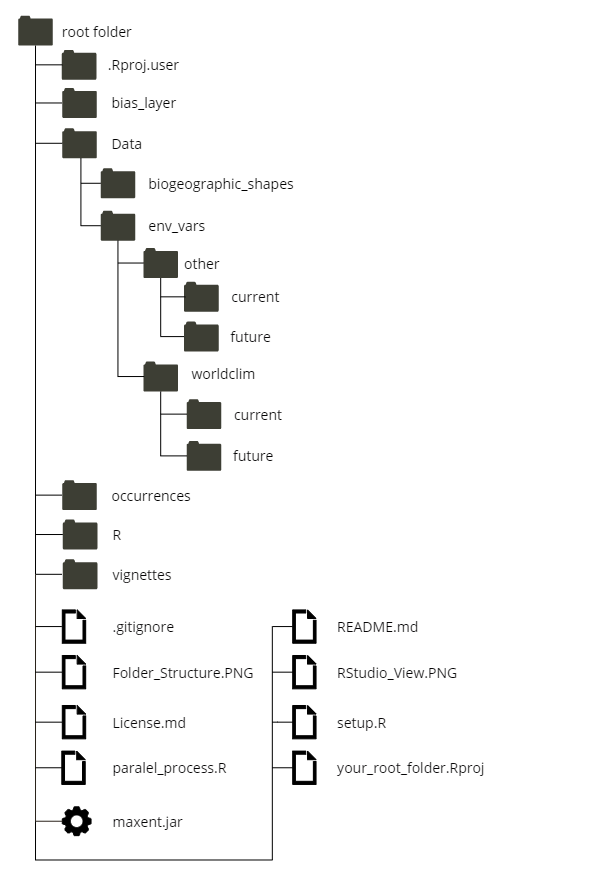
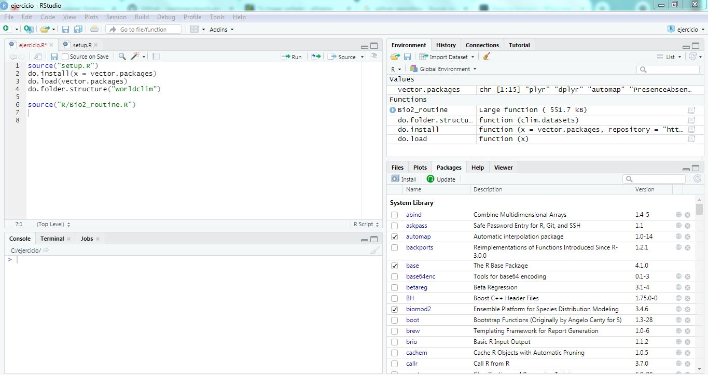

# BioModelos 2

BioModelos 2 is an effort to construct thousands of Species Distribution Models from databases gathered and managed by the Instituto de Investigacion de Recursos Biologicos Alexander von Humboldt (IAvH). It is attached to BioModelos initiative from the IAvH. "BioModelos 2" follows an automatized SDM general routine. First, it cleans occurrence data and constructs the accessible area when is necesary. Second, it crops and masks current and future environmental variables. Third, it creates SDM's using several machine learning algorithms and then ensembles them. Fourth, it projects to future scenarios and evaluates extrapolation.

Current state: in development. Version 1.0.0

## Prerequisites

### Dependencies and files

Dependencies to install, choose the version depending on your operating system and version. For example, a windows 10 terminal with more than 4 gigabytes on memory RAM almost always has a 64 bit version of windows. Surf on the web in case of more information.

* [R](https://cran.r-project.org/mirrors.html)
* [RStudio](https://www.rstudio.com/products/rstudio/download/#download)
* [Rtools](https://cran.r-project.org/bin/windows/Rtools/)
* [Java Development Kit](https://www.oracle.com/java/technologies/javase/javase-jdk8-downloads.html)
* [Maxent](https://drive.google.com/file/d/1a-0QPZyqk9DFWEm7rSreBTYiuTJDgABR/view)
* [BioModelos 2 repositiry](https://github.com/cmunozr/16kproject_IAVH) update to the permanent repository

### Libraries
Libraries required and their versions

```
"dplyr" version 1.04
"plyr" version 1.8.6
"rJava" version 0.9-13
"automap" version 0.9-13
"PresenceAbsence" version 1.1.9
"devtools" version 2.3.2
"CoordinateCleaner" version 2.0-18
"sf" version 0.9-7
"spThin" version 0.2.0
"raster" version 3.4-5
"dismo" version 1.3-3
"biomod2" version 3.4.6
"ENMeval" version 0.3.1
"rgdal" version 1.5-23
"kuenm" version 1.1.6
```

## How to run

1. Create a folder and move (uncompressed) the content of this repository and "maxent.jar" file (downloaded previously) there. For better results choose a root directory like "C" or "D" in windows to create the folder (working directory).

2. Open RStudio and create a new project using the folder created as working directory. It can be achieving doing the next. First, click on tool bar "File" (upper left of the RStudio window). Second, "New Project". In the opened window, click on "Existing Directory". After that, browse into the computer folder structure until reach the folder created in the step 1. Last, get click on "Create Project". *Note: This step is comparative to setup a working directory with* `setwd()`

3.  Create in RStudio a new script. It can be achieve going to "File" tool bar, "New File" and then "R Script". It may well be used the icon "New file" right under the tool bar "File" or using the keyboard shortcut "Ctrl+Shift+N" in windows.

4. Load the setup functions of **BioModelos 2**. In the script editor type 

```
source("setup.R")
``` 

5. Then run it using the icon "Run" or the keyboard shortcut "Ctrl+Enter" in windows. You will find four new objects in the environment (upper left portion of the RStudio window)
+ *vector.packages* vector character that stores the name of each package necessary to run **BioModelos 2**
+ *do.folder.structure* function to create folders to organize work process in the working directory.
+ *do.install* automatic installation of needed packages
+ *do.load* automatic loading of needed packages

6. Run the automatic installation in the editor script. The process will install the packages stored in the 'vector.packages' object. In case of showing a compilation window procedure accept as it diminish likely of installation errors, it is slower than a traditional method, so be patient. Warning: if you have a version of ENMeval package lower or higher than 0.3.1 it will be replace by the former.
```
do.install(vector.packages)
``` 

You only need to install the packages once, so, it is better to block this command line typing a '#' character in the forefront of the line just before of the first run, like this `# do.install(vector.packages)`. If you need to troubleshoot on installing the packages, please refer to the vignete **Manual Installation of Packages** MISSING.

7. Load the installed packages with

```
do.load(vector.packages)
``` 
8. Create the structure of folders typing and run. The use of the character 'worldclim' inside the function does not refer to retrieve the data from the repository. It is only a way to create an organized framework inside the working directory in which you may store the variables downloaded manually or using automatized tools. 

```
do.folder.structure(clim.datasets = "worldclim")
``` 
After run the function you will have in your working directory 3 new folders with subfolders:

* *Bias_layer* to storage bias file layers created (please refer to the vignette **Constructing Bias Layer**, [this article](https://onlinelibrary.wiley.com/doi/10.1111/j.1600-0587.2013.07872.x) and this [blog](https://scottrinnan.wordpress.com/2015/08/31/how-to-construct-a-bias-file-with-r-for-use-in-maxent-modeling/)
* *Data* to storage geographical data. Sub-folders:
  + *biogeographic_shp* storage biogeographic, ecoregions or hydrosheets objects used to construct accessible areas of species
  + *env_vars* to storage of environmental variables. Sub-folders:
    + *other* environmental variables not related with climate but consider important to modeled species
      + *future*
      + *current*
    + *climatic* climatic variables
      + *future*
      + *current*
  + *shapes* to storage of useful shapefiles like Colombian or American borders
* Occurrences to storage geographical records of species, those records must have a column with name species, latitude and longitude in decimal format 

9. Load the wrapper function "Bio2_routine". This function follows the basic structure of an "Ecological Niche Modeling" (ENM) process (Peterson et al, 2011). It calls several subroutines to achieve this with a few inputs and having a wide range of customization. Also, it is useful for users not familiarized with ENM's or R. Please refer to **Structure and Functions** and **More deep in Bio2_routine** vignettes to find more information about. 

```
source("R/Bio2_routine.R")
``` 

### Folder structure and RStudio window

Your folder structure must look like this:



Your RStudio window must look like this:




Now you are ready to load the Bio2_routine, customize it and run ENM models. To go deep in this function revise **Structure and Functions** and **More deep in Bio2_routine** vignette.

## Example

Having done the earlier steps, move the files inside of the folder *Example* to the main folder. It will overwrite the folders *Data* and *Occurrences*, please let the process continue if you are asked about. Let us to explore these folders:


In this example, we are going to run a simple ENM 


## Authors and contact

* **Carlos Jair Muñoz Rodriguez** - *Initial development* - [cmunoz@humboldt.org.co](cmunoz@humboldt.org.co)

* **Gabriel Alejandro Perilla Suarez** - *Initial development* - 

* **Héctor Manuel Arango Martínez** - *Initial development* - 

* **Cristian Alexander Cruz Rodriguez** - *Initial development* - 

* **Luis Hernando Romero Jiménez** - *Initial development* - 

* **Andrés Felipe Suárez Castro** - *Initial development* - 

* **Elkin Alexi Noguera Urbano** - *Initial development* - 


## License

This project is licensed under the MIT License - see the [License.md](License.md) file for details

## Acknowledgments

* Kuenm team
* ENMeval team
* Biomod team
* LAE UNAM team