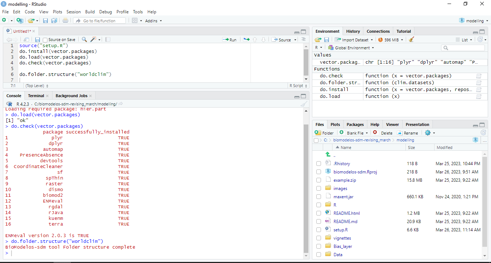
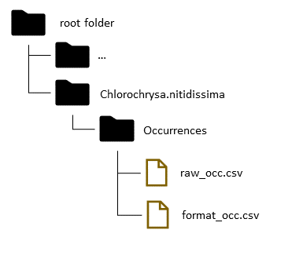

# Modelling repository

 This repository stores functions to automate the construction of Species Distribution Models (SDM). The functions follow an automatized and flexible SDM general routine. First, it cleans occurrence data when is necessary and construct geographical areas in which those models will be trained. Second, they crops and masks current and future environmental variables. Third, the functions train  SDM's using one or several algorithms, then evaluate them quantitatively and ensemble the best of each one. Fourth, they project to different scenarios at user discretion.

Current state: in development.

### Deploying:

Sprint 1
Start time: October 10th 2022
End time: October 20th

* Include ENMeval2 and organize models methods.
* Remove cleaning occurrences features as it will be part of the preprocessing stage. However, spatial thinning feature will be maintained.

Sprint 2, 3, 4
Start time: January 2023
Expected end time: February 2023

What is left to deploy
* The work flow won't be conditioned to occurrences. What algorithm, package and methods will be chosen by users.
* Revise projection M-M and M-G and future with several case use
* Documentation: update past documentation, generate additional documents for past features added during 2020 and 2021, new features documents
* Vignettes for user and developers


## Prerequisites

### Dependencies and files

Dependencies to install, choose the version depending on your operating system and version. For example, a windows 10 terminal with more than 4 gigabytes on memory RAM almost always has a 64 bit version of windows. Surf on the web in case of more information.

* [R](https://cran.r-project.org/mirrors.html) version 4.1.0 or upper
* [RStudio](https://www.rstudio.com/products/rstudio/download/#download) version 1.4 or upper
* [Rtools](https://cran.r-project.org/bin/windows/Rtools/) version 4.0 or upper
* [Java Development Kit](https://www.oracle.com/java/technologies/javase/javase-jdk8-downloads.html) version 8.0 or upper
* [Maxent](https://biodiversityinformatics.amnh.org/open_source/maxent/) version 3 or upper
* This repository (BioModelos)

### Libraries
Libraries required and their versions

```
"plyr" version 1.8.6
"dplyr" version 1.0.5
"automap" version 1.0.14
"PresenceAbsence" version 1.1.9
"devtools" version 2.3.2
"CoordinateCleaner" version 2.0.18
"sf" version 0.9.8
"spThin" version 0.2.0
"raster" version 3.4.10
"dismo" version 1.3.3
"biomod2" version 3.4.6
"ENMeval" version 0.3.1
"rgdal" version 1.5.23
"rJava" version 0.9.13
"kuenm" version 1.1.6
```

## How to run

1. Create a folder and move (uncompressed) the content of this repository and "maxent.jar" file (downloaded previously) there. For better results choose a root directory like "C" or "D" in windows to create the folder (working directory).

2. Open RStudio and create a new project using the folder created as working directory. It can be achieving doing the next. First, click on tool bar "File" (upper left of the RStudio window). Second, "New Project". In the opened window, click on "Existing Directory". After that, browse into the computer folder structure until reach the folder created in the step 1. Last, get click on "Create Project". *Note: For a bit more experimented users, this step is comparative to setup a working directory with* `setwd()`.

3.  Create in RStudio a new script. It can be achieve going to "File" tool bar, "New File" and then "R Script". It may well be used the icon "New file" right under the tool bar "File" or using the keyboard shortcut "Ctrl+Shift+N" in windows.

4. Load the setup functions of **BioModelos 2**. In the script editor type

```
source("setup.R")
```

5. Then run it using the icon "Run" or the keyboard shortcut "Ctrl+Enter" in windows. You will find four new objects in the environment (upper left portion of the RStudio window)
+ *vector.packages* vector character that stores the name of each package necessary to run **BioModelos 2**
+ *do.install* automatic installation of needed packages
+ *do.check* function to verify if the installation of vector packages was successful
+ *do.load* automatic loading of needed packages
+ *do.folder.structure* function to create folders to organize work process in the working directory.

6. Run the automatic installation in the editor script. The process will install the packages stored in the 'vector.packages' object. In case of showing a compilation window procedure accept as it diminish likely of installation errors, it is slower than a traditional method, so be patient. In case of showing an updating message in the RStudio Console (left down in the window),  Warning: if you have a version of ENMeval package lower or higher than 0.3.1 it will be replace by the former.
```
do.install(vector.packages)
```

You only need to install the packages once, so, it is better to block this command line typing a '#' character in the forefront of the line just before of the first run, like this `# do.install(vector.packages)` or even erase the line.

7. Verify if packages were successfully installed using
```
do.check(vector.packages)
```
A message showing a table with column names "package" and "successfully_completed" will be shown in the console (corner left of the RStudio window), as well as the ENMeval version installed. For example,

```
             package successfully_installed
1               plyr                  TRUE
2              dplyr                  TRUE
3            automap                  TRUE
4    PresenceAbsence                  TRUE
5           devtools                  TRUE
6  CoordinateCleaner                  TRUE
7                 sf                  TRUE
8             spThin                  TRUE
9             raster                  TRUE
10             dismo                  TRUE
11           biomod2                  TRUE
12           ENMeval                  TRUE
13             rgdal                  TRUE
14             rJava                  TRUE
15             kuenm                  TRUE

ENMeval version 0.3.1 is TRUE
```

In case of receiving a FALSE statement on the table or having an ENMeval version different to 0.3.1, you need to troubleshoot before to continue. Please refer to the vignette **Manual Installation of Packages** MISSING.

8. Load the installed packages with

```
do.load(vector.packages)
```
9. Create the structure of folders typing and run.

```
do.folder.structure(clim.datasets = "worldclim")
```

The use of the character "worldclim"" inside the function does not refer to retrieve the data from the repository. It is only a way to create an organized a framework inside the working directory in which you may store the environmental variables and occurrence data of species downloaded manually or using automatized tools.

After run the function you will have in your working directory 3 new folders with subfolders:

* *Bias_layer* to storage bias file layers created (please refer to the vignette **Constructing Bias Layer**, [this article](https://onlinelibrary.wiley.com/doi/10.1111/j.1600-0587.2013.07872.x) and this [blog](https://scottrinnan.wordpress.com/2015/08/31/how-to-construct-a-bias-file-with-r-for-use-in-maxent-modeling/)
* *Data* to storage geographical data. Sub-folders:
  + *biogeographic_shp* storage biogeographic, ecoregions or hydrosheets objects used to construct accessible areas of species
  + *env_vars* to storage environmental variables. Most used files can be ".tif" or ".asc". Supported file types are the 'native' raster package format and those that can be read via [rgdal](https://www.rdocumentation.org/packages/rgdal/versions/1.5-23/topics/readGDAL). Sub-folders:
    + *other* environmental variables not related with climate but consider important to modeled species
      + *future*
      + *current*
    + *climatic* climatic variables consider important to modeled species
      + *future*
      + *current*
  + *shapes* to storage of useful shapefiles like Colombian or American borders
* *Occurrences* to storage geographical records of species, those records must have a column with name species, latitude and longitude in decimal format

10. Load the wrapper function "Bio2_routine". This function follows the basic structure of an "Ecological Niche Modeling" (ENM) process (Peterson et al, 2011). It calls several subroutines to achieve this with a few inputs and having a wide range of customization. Also, it is useful for users not familiarized with ENM's or R.

```
source("R/Bio2_routine.R")
```

For help go to [Bio2_routine](vignettes/Bio2_routine.md) and [Structure and Functions]() vignettes to find more information about.

### Folder structure and RStudio window

Your folder structure must look like this:


Your RStudio window must look like this:




Now you are ready to customize Bio2_routine and run SDM models. You only need,as said before, two more basic elements: environmental variables and georeferenced occurrence data of one or several species. We encourage you to follow the next section. It will show you the structure and characteristics of both elements and transcendental information to run and learn about this application. Also, to go deep in this function revise **Structure and Functions** and [Bio2_routine](vignettes/Bio2_routine.md) vignette.

## Working Example

### Environmental Data and Ocurrences

Having done the earlier steps, extract the files inside of the ".zip" folder *Example* to the main root folder. It will overwrite the *Bias_file*, *Data*, and *Occurrences* folders, please let the process continue if you are asked about. Inside the *Data* folder you will find environmental variables representing climatic and other factors of current and future scenarios (for future scenarios projection and training go to vignette **exercises**). In the current worldclim folder you will observe two raster files ".tif". On the other hand, you will get two spreadsheets in ".csv" format inside the *Occurrences* folder. Each ".csv" stores occurrence data, the first one is a single species database with column labels "species", "lon" and "lat", the second one is a multiple species database (5 species) using identical column names.

In this example, we are going to run a simple ENM of a single species database, a colorful bird species called [Chlorochrysa nitidissima](https://ebird.org/species/multan1?siteLanguage=es). So, load the "single_species.csv". After loading, feel free to explore the object call *dataSp*.

```
dataSp <- read.csv("Example/Occurrences/single_species.csv")
```

### Running

Once the species occurrence data and environmental variables are ready, the function `Bio2_routine()` can be customized and run. In this specific example, we are going to use:

```
Bio2_routine(
  occ = dataSp, col_sp = "species", col_lat = "lat",
  col_lon = "lon", clim_vars = "worldclim", dir_clim = "Data/env_vars/",
  dir_other = "Data/env_vars/other/", method_M = "points_buffer", dist_MOV = 74,
  proj_models = "M-M", algos = "MAXENT", dist_uniq = 10
)
```

A quick explanation for each of these arguments:

+ Occurrences (**occ**) database is *dataSp* (the database loaded before).
+ Column name of species **col_sp** in the database is *species* .
+ Column in which is the longitude (**col_lon**) information in the database is *lon*.
+ Column in which is the latitude (**col_lat**) information  in the database is *lat*.
+ Name of climatic variables (**clim_vars**) is *worldclim*, with this character string the function will search on the directory path.
+ The climatic directory (**dir_clim**) is located in *Data/env_vars/"* and the not-climatic variables (**dir_other**) are inside *Data/env_vars/other/*.
+ The niche models will be calibrated and projected in the accessible area (*M-M*)
+ method_M makes reference to what metodology is selected to construct de accesible area, in this case it is constructed inside a buffer to each occurrence point around a movement distance (**dist_Mov**) of 74 kilometers.
+ Algorithm (**algos**) used will be *MAXENT*.


There are several more arguments and ways to customize them, revise the [Bio2_routine](vignettes/Bio2_routine.md) vignette.

### Checking console messages and working directory folder

Once you run the last script, you would monitor the process in the console (left down in RStudio) and the working directory folder. In the next table we show how the function works. Each row represents a working step (from zero 0 to 6) that is explained in the column "Action in progress" and you will find what messages are displayed in the RStudio console and how your working directory looks.

|Step|Action in progress|Console message|Working folder|
|-|--|-|--|
|0   |Just after running, the routine creates a species folder in the working directory. Inside the last, it sets up a temporary folder for raster files (Temp), occurrences by species, and a log file. The log file is used to save the parameters given to the function and make possible to reproduce the modeling process. You are allowed to see the content of the log file at the end of the process, see the vignette **knowing your log file** MISSING.|``` [1] "Preparing folders and files"```||
|1   |Detecting and correcting (or removing) corrupt or inaccurate records from the database. In a first moment the routine searches missing coordinates or having strange characters. Then, in an optional step, when *do_clean = TRUE* and *drop_out = IQR*, it removes geographical outliers and data potentially problematic making use of the [CoordinateCleaner](https://cran.r-project.org/web/packages/CoordinateCleaner/index.html) package.|``` [1] "Cleaning data"```||
|2   |Spatial thinning of occurrence records in a way to diminish the bias sample and make the process more efficient. Here, by default the function uses [clean_dup](https://github.com/luismurao/ntbox/blob/master/R/clean_dup.R) from [ntbox](https://github.com/luismurao/ntbox/tree/master/R), but can be customized to run [spThin](https://cran.r-project.org/web/packages/spThin/spThin.pdf).|```[1] "Thinning database to 1km, using  sqkm"```| |
|3   |Constructing research areas or accessible areas in which the algorithm(s) selected will be trained, or projected in current or future scenarios. In this way, *Bio2_routine* has several options to construct them. Those are called "Interest areas". Please see [Bio2_routine](vignettes/Bio2_routine.md) vignette.|```[1] "Constructing accessible area"```|   |
|4   |Cropping and masking the environmental variables, either be current or future ones. It also stores them temporally in a folder call M (or G in case of transferring/projecting the model to other areas)|```[1] "Processing environmental layers"```|  |
|Optional|Cropping and masking the bias layer constructed by the user to accessible area extent|```[1] "Processing bias layer"```|   |
|5   |Running algorithms chosen and evaluating them. Supported algorithms include Maxent and those native to [BIOMOD2](https://cran.r-project.org/web/packages/biomod2/index.html). In the current version only Maxent hyperparameters are tuned using [ENMeval](https://cran.r-project.org/web/packages/ENMeval/index.html) or [Kuenm](https://github.com/marlonecobos/kuenm). If there are less than 25 occurrence species records a jackknife procedure is performed, by the other side the models are tuned using blocks. Algorithms runned by Biomod are replicated 10 times. Evaluation of models depends on a hierarchical selection of best Partial Roc (only for Kuenm and Biomod) or AUC (only for ENMeval), Akaike Information Criterion, and the lowest omission rate at user discretion percentile (default 10th).|```[1] "Calibrating and evaluating SDM's"```|   |
|6   |Ensambling the best models of each algorithm type. A median, coefficient of variation, standard deviation and sum are calculated, those measures are not performed if only one model is selected. 4 threshold-type maps are calculated from the median: minimum threshold presence, ten threshold percentile, twenty threshold percentile and thirty threshold according to [Biomodelos framework](http://biomodelos.humboldt.org.co/).|```[1] "Ensembles"```|   |
|7   |Removing temporal files. The final number, class and type of files is controlled by the argument *keep_files*. Please, see documentation.|```[1] "Erase files"```|   |
|8   |Close log file and ending execution.|```[1] "ok. Chlorochrysa.nitidissima [Species Name]"```|  |

## References and packages

Kramer-Schadt, S., Niedballa, J., Pilgrim, J.D., Schröder, B., Lindenborn, J., Reinfelder, V., Stillfried, M., Heckmann, I., Scharf, A.K., Augeri, D.M., Cheyne, S.M., Hearn, A.J., Ross, J., Macdonald, D.W., Mathai, J., Eaton, J., Marshall, A.J., Semiadi, G., Rustam, R., Bernard, H., Alfred, R., Samejima, H., Duckworth, J.W., Breitenmoser-Wuersten, C., Belant, J.L., Hofer, H. and Wilting, A. (2013), The importance of correcting for sampling bias in MaxEnt species distribution models. Diversity Distrib., 19: 1366-1379. https://doi.org/10.1111/ddi.12096

Peterson, A., Soberón, J., G. Pearson, R., Anderson, R., Martínez-Meyer, E., Nakamura,M., y Araújo, M. (2011) Ecological Niches and Geographic Distributions, tomo 49.  360 pp.

Velásquez-Tibata,  J. I., Olaya-Rodríguez, M. H., López-Lozano, D. F., Gutierrez, C., Gonzales, I., & Londoño-Murcia, M. C. 2019. Biomodelos: a collaborative online system to map species distributions. Plos One, 14(3), e0214522.  https://doi.org/10.1371/journal.pone.0214522

### Packages

Aiello-Lammens, M. E., Boria, R. A., Radosavljevic, A. , Vilela, B. and Anderson, R. P.   (2015). spThin: an R package for spatial thinning of species occurrence records for use in ecological niche models. Ecography, 38: 541-545. URL https://onlinelibrary.wiley.com/doi/10.1111/ecog.01132.

Cobos ME, Peterson AT, Barve N, Osorio-Olvera L. (2019) kuenm: an R package for detailed development of ecological niche models using Maxent PeerJ, 7:e6281 URL http://doi.org/10.7717/peerj.6281

Freeman, E. A. and Moisen, G. (2008). PresenceAbsence: An R Package for Presence-Absence Model Analysis. Journal of Statistical Software, 23(11):1-31. http://www.jstatsoft.org/v23/i11

Hadley Wickham (2011). The Split-Apply-Combine Strategy for Data Analysis. Journal of Statistical Software, 40(1), 1-29. URL http://www.jstatsoft.org/v40/i01/

Hadley Wickham, Jim Hester and Winston Chang (2021). devtools: Tools to Make Developing R  Packages Easier. R package version 2.4.2. https://CRAN.R-project.org/package=devtools

Hadley Wickham, Romain François, Lionel Henry and Kirill Müller (2021). dplyr: A Grammar of Data Manipulation. R package version 1.0.7. https://CRAN.R-project.org/package=dplyr

Hiemstra, P.H., Pebesma, E.J., Twenhofel, C.J.W. and G.B.M. Heuvelink, 2008. Real-time
automatic interpolation of ambient gamma dose rates from the Dutch Radioactivity
Monitoring Network. Computers & Geosciences, accepted for publication.

Muscarella, R., Galante, P.J., Soley-Guardia, M., Boria, R.A., Kass, J., Uriarte, M. and R.P. Anderson (2014). ENMeval: An R package for conducting spatially independent evaluations and estimating optimal model complexity for ecological niche models. Methods in Ecology and Evolution.

Osorio-Olvera L., Lira‐Noriega, A., Soberón, J., Townsend Peterson, A., Falconi, M., Contreras‐Díaz, R.G., Martínez‐Meyer, E., Barve, V. and Barve, N. (2020), ntbox: an R package with graphical user interface for modeling and evaluating multidimensional ecological niches. Methods Ecol Evol. 11, 1199–1206. doi:10.1111/2041-210X.13452. https://github.com/luismurao/ntbox

Pebesma, E., 2018. Simple Features for R: Standardized Support for Spatial Vector Data. The R Journal 10 (1), 439-446, https://doi.org/10.32614/RJ-2018-009

Robert J. Hijmans, Steven Phillips, John Leathwick and Jane Elith (2020). dismo: Species Distribution Modeling. R package version 1.3-3. https://CRAN.R-project.org/package=dismo

Robert J. Hijmans (2021). raster: Geographic Data Analysis and Modeling. R package version 3.4-13. https://CRAN.R-project.org/package=raster

Roger Bivand, Tim Keitt and Barry Rowlingson (2021). rgdal: Bindings for the 'Geospatial' Data Abstraction Library. R package version 1.5-23. https://CRAN.R-project.org/package=rgdal

Simon Urbanek (2021). rJava: Low-Level R to Java Interface. R package version 1.0-4. https://CRAN.R-project.org/package=rJava

Wilfried Thuiller, Damien Georges, Maya Gueguen, Robin Engler and Frank Breiner (2021). biomod2: Ensemble Platform for Species Distribution Modeling. R package version 3.5.1. https://CRAN.R-project.org/package=biomod2

Zizka A, Silvestro D, Andermann T, Azevedo J, Duarte Ritter C, Edler D, Farooq H, Herdean
A, Ariza M, Scharn R, Svanteson S, Wengstrom N, Zizka V, Antonelli A (2019).
“CoordinateCleaner: standardized cleaning of occurrence records from biological collection
databases.” _Methods in Ecology and Evolution_, -7. doi: 10.1111/2041-210X.13152 (URL:
https://doi.org/10.1111/2041-210X.13152), R package version 2.0-18, <URL:
https://github.com/ropensci/CoordinateCleaner>.

## Authors and contact

* **Carlos Jair Muñoz Rodriguez, [contacto institucional](mailto:cmunoz@humboldt.org.co), [contacto personal](mailto:cmunozbiol@gmail.com)**

* **María Helena Olaya, [contacto institucional](mailto:molaya@humboldt.org.co ), [contacto personal](mailto:olaya42@gmail.com)**

* **Gabriel Alejandro Perilla Suarez, [contacto institucional](mailto:gperilla@humboldt.org.co), [contacto personal](mailto:thealejandroperilla@gmail.com)**

* **Héctor Manuel Arango Martínez, [contacto institucional](mailto:harango@humboldt.org.co), [contacto personal](hma9327@gmail.com)**

* **Cristian Alexander Cruz Rodriguez, [contacto institucional](mailto:ccruz@humboldt.org.co), [contacto personal](cruzrodriguezcristian@gmail.com)**

* **Luis Hernando Romero Jiménez, [contacto institucional](mailto:lromero@humboldt.org.co), [contacto personal](mailto:lhromeroj@gmail.com)**

* **Andrés Felipe Suárez Castro, [contacto personal](mailto:felipesuarezca@gmail.com)**

* **Elkin Alexi Noguera Urbano, [contacto institucional](mailto:enoguera@humboldt.org.co), [contacto personal](mailto:elkalexno@gmail.com)**

## Acknowledgment

NatGeo
Natural map

## License

This project is licensed under the MIT License - see the [License.md](License.md) file for details
