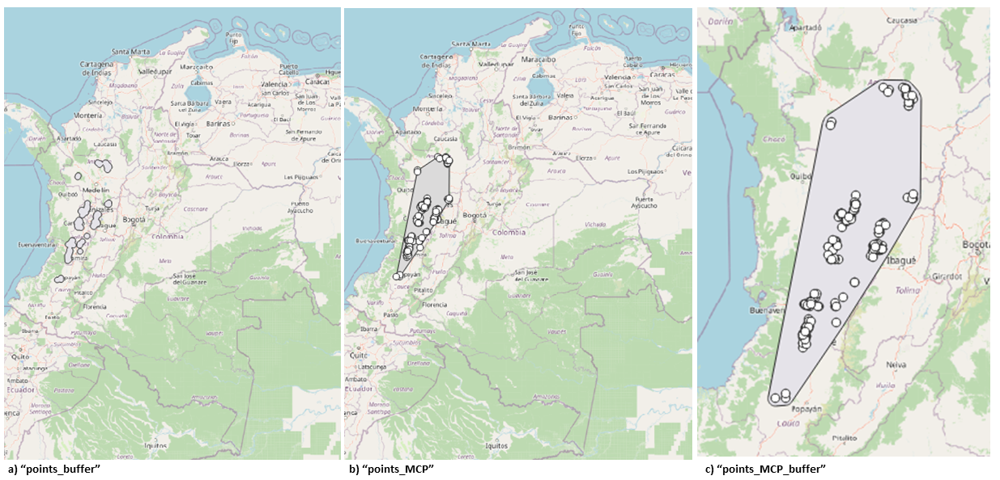
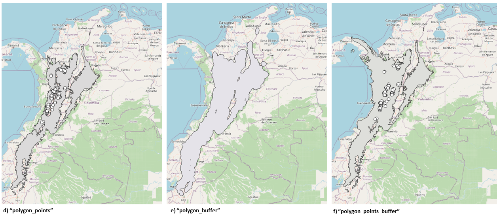
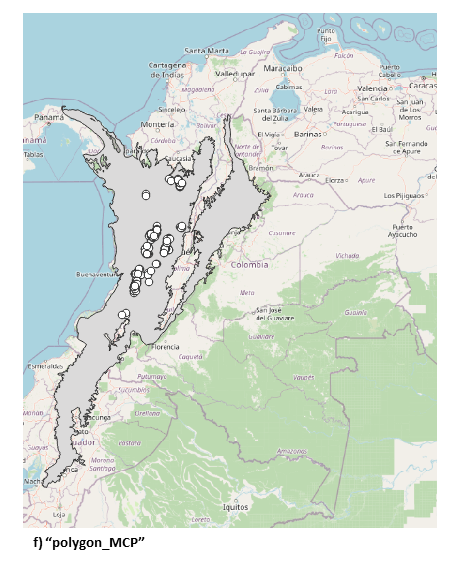

# fit_biomodelos

## Going deep inside of the main function of biomodelos-sdm tool

### Description

`fit_biomodelos` is a function that automates the process of fitting Species Distribution Models (SDMs) using occurrence and environmental data. The function follows a flexible and automated general routine to fit the SDMs. It formats occurrence data, constructs geographical areas, crops and masks environmental variables, trains SDMs using one or several algorithms, evaluates them quantitatively, and ensembles the best of each one. It also projects to different scenarios based on user input.

### Usage

`function(occ, col_sp = NULL, col_lat = NULL, col_lon = NULL, clim_vars, dir_clim = NULL, dir_other = NULL, file_extension = NULL, remove_method = NULL, remove_distance = NULL, use_bias = NULL, TGS_kernel = NULL, proj_models, area_M = NULL, method_M = NULL, dist_MOV = NULL, area_G = NULL, method_G = NULL, compute_G = NULL, dir_G = NULL, do_future = NULL, method_F = NULL, area_F = NULL, polygon_data = NULL, compute_F = NULL, dir_F = NULL, cor_eval = NULL, cor_method = NULL, cor_detail = NULL,  beta_small_sample = NULL, fc_small_sample = NULL, beta_large_sample = NULL, fc_large_sample = NULL, E = NULL, extrapo = NULL, kept = NULL, maxent_package = NULL, crs_proyect = NULL, tipo = NULL, erase_files = NULL, transf_biomo_ext = NULL, redo = NULL, redo_path = NULL)`

### Arguments

Arguments will be presented in theme groups: i) managing species occurrences, ii) interest areas, iii) environmental variables, iv) bias and sampling management, v) details algorithm Maxent

#### Managing species occurrences

-   **occ** data frame: occurrence data base of a single species. As a minimum, the data base must have species name, latitude, longitude, and date columns. It does not matter the order of the database or if there are companion columns. No Default defined. Example:

| acceptedNameUsage        | ... | decimalLatitude | decimalLongitude | ... |
|--------------------------|-----|-----------------|------------------|-----|
| Anisognathus melanogenys | ... | 11.1085         | -74.0612         | ... |
| Anisognathus melanogenys | ... | 11.1041         | -74.0695         | ... |
| Anisognathus melanogenys | ... | 11.1113         | -74.0549         | ... |
| Anisognathus melanogenys | ... | 11.1096         | -74.0449         | ... |
| Anisognathus melanogenys | ... | 11.1073         | -74.0489         | ... |
| Anisognathus melanogenys | ... | 11.1024         | -74.0616         | ... |
| ...                      | ... | ...             | ...              | ... |

-   **col_sp** character: containing the species name column. Default: "acceptedNameUsage".
-   **col_lat** character: containing the latitude coordinate name column. Default: "decimalLatitude".
-   **col_lon** character: containing the longitude coordinate name column. Default: "decimalLongitude".

#### Interest areas

Methods to construct geographical areas to calibrate and project the models. Three areas are defined: M stands for calibration area (accesible area or train area), G and F are areas where is projected the model. Each of those areas have spatial methods to be constructed.

-   **proj_models** character: it would be "M-M" or "M-G".The parameter specifies if the training area is the same as the projection area. M area can be define as the accessible area in which algorithm is trained, G area in which is going to be projected the trained model in current time or same as M.

-   **method_M** character: character string, method to define the area to train ecological niche models. See details for options. Default: "points_buffer". See next for more details.

-   **method_G** character: character string, method to define the area to project with current climate. It is used if compute.G is set to TRUE and proj.models is "M-G". See next for more details.

-   **method_F** character: character string, method to define the area to project with future climate. It is used if do.future and compute.F are set to TRUE See next for more details.

The method.M, method.G and method.F are parameters defined by character string that specifies the method to define each interest area. The method parameter can take the following values:

1.  "points_buffer": This method generates a buffer around the occurrence points (given by dist_Mov).

2.  "points_MCP": This method generates a minimum convex polygon around the occurrence points.

3.  "points_MCP_buffer": This method generates a minimum convex polygon around the occurrence points, applies a buffer of a specified distance (given by dist_Mov) around the polygon, and then clips the polygon to the study area boundary.

  

4.  "polygon_points": This method intersects a biogeographic area multi-polygon (given by polygon_data) with the occurrence points to create a new polygon that covers the study area and contains all occurrence points.

5.  "polygon_buffer": This method intersects a biogeographic area multi-polygon (given by polygon.data) with the occurrence points and then create a buffer of a specified distance (given by dist_Mov) around the selected polygon to create a new polygon that covers the study area and contains all occurrence points and a buffer.

6.  "polygon_points_buffer": This method intersects a biogeographic area multi-polygon (given by polygon_data) with a buffer of a specified distance (given by dist.Mov) around the occurrence points, then clips the resulting polygon to the study area boundary.

    

7.  "polygon_MCP": This method generates a new polygon that covers the study area and contains all occurrence points by intersecting a study area polygon (specified by polygon_data) with a minimum convex polygon around the occurrence points. This method removes any non-contiguous polygons, resulting in a single, continuous polygon that covers the study area and all occurrence points.

    {width="376"}

-   **dist_MOV** numeric: distance in kilometers of

-   **proj_models** character

-   **area_G** character

-   **compute_G** logical

-   **dir_G** character

-   **do_future** logical

-   **area_F** character

-   **compute_F** logical

-   **dir_F** character

-   **polygon_data** character, path to spatial data to construct interest areas .

-   **raster_data** character, path

#### Environmental variables

Environmental variables characterizes the environment asociated to distribution records. This description can be made because those variables are stored as raster images. Those raster are geo-referenced matrix structures containing information by each cell. The information can be extracted using Geographical Information Tools (Petersonet al., 2011).

-   **clim_vars** character: filename of climatic data set to use. It is useful when you want to compare fit of different climatic data sets. It would be created using the 'do.folder.structure' function. No Default assigned. More information in the [biomodelos-sdm tool readme](https://github.com/PEM-Humboldt/biomodelos-sdm/blob/revising_march/modelling/README.md).
-   **dir_clim** character: path in where is stored the climatic data set specified in clim_vars. Default: "Data/env_vars/".
-   **dir_other** character: path in where is stored the other environmental variables. Default: "Data/env_vars/other/".
-   **file_xtension** character: regular expression to find the environmental raster layers to load. Supported file types are the 'native' raster or terra package format and those that can be read via rgdal or rgeos (see [raster formats](https://www.rdocumentation.org/packages/raster/versions/3.4-10/topics/writeFormats)) Default: "\*.tif\$".

#### Bias and sampling management

Spatial bias usually leads to environmental bias because of the over-representation of certain environmental features of the more accessible and extensively surveyed areas. Sampling bias can be addressed by: spatial thinning or the inclusion of so-called bias files. Spatial thinning of species occurrence records can help address problems associated with spatial sampling biases. Ideally, thinning removes the fewest records necessary to substantially reduce the effects of sampling bias, while simultaneously retaining the greatest amount of useful information. Bias files allow the user to choose background data with the same bias as occurrence data.

-   **remove_method** character: two methods are available: "sqkm" and "spthin". The former divides the geographical extent in squares of an user select distance and let one (1) occurrence record by each of those squares, it uses the function [clean_dup](https://github.com/luismurao/nichetoolbox/blob/master/R/clean_dup.R) from the package [nichetoolbox](https://www.google.com/search?q=nichetoolbox&rlz=1C1CHBF_esCO935CO935&oq=nichetoolbox&aqs=chrome..69i57j0i19i30j69i60l2j69i61.2307j1j4&sourceid=chrome&ie=UTF-8). The latter uses a randomization algorithm to create a data set in which each record is at least an user select distance apart, it uses the function [thin](https://github.com/cran/spThin/blob/master/R/thin.R) from the [spThin](https://cran.r-project.org/web/packages/spThin/spThin.pdf) package. Default: "sqkm".

-   **remove_distance** numeric: distance in kilometers to be used as threshold in the removing spatial duplicates process.

-   **use_bias** logical: correcting bias using a bias layer enable or disabled. Default: FALSE.

-   **TGS_kernel** character: path to pre-processed bias layer file. Target Group Sampling (TGS; Ponder etal. 2001, Phillips etal. 2009). TGS uses the presence locations of taxonomically related species observed using the same techniques as the focal species (usually from the same database) to estimate sampling, under the assumption that those surveys would have recorded the focal species had it occurred there (Phillips etal. 2009). For a beginner guide see the [Scott Rinann's blog](https://scottrinnan.wordpress.com/2015/08/31/how-to-construct-a-bias-file-with-r-for-use-in-maxent-modeling/)

#### Details algorithm Maxent

-   **beta_5.25**
-   **fc_5.25**
-   **beta_25**
-   **fc_25**
-   **E**
-   **extrapo**

#### Miscellaneous

-   **crs_proyect** character: final output spatial reference. Default: "+proj=longlat +datum=WGS84 +no_defs +type=crs"
-   **tipo** character: adds a suffix to the species main folder in, useful in experimental or comparative settings. Default: ""
-   **kept** logical: removes the candidate models folder and files created by the package kuenm. Default: TRUE.
-   **erase_files** character: certain files from the species main folder are kept in order to reduce disk usage. Three methods allowed. "all" keeps every file and folder creates in the process of setting SDM. "essential" keeps evaluation, final, ensembles, processed occurrences and geographical areas constructed folders and files. "none" keeps only ensembles, processed occurrences and geographical areas constructed.\
-   **transf_biomo_ext** logical: if TRUE extends the model to the BioModelos extension with NA data. It is usful to make operations between SDMs. Default: TRUE.
