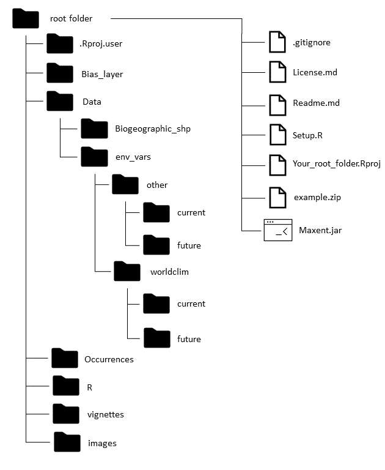
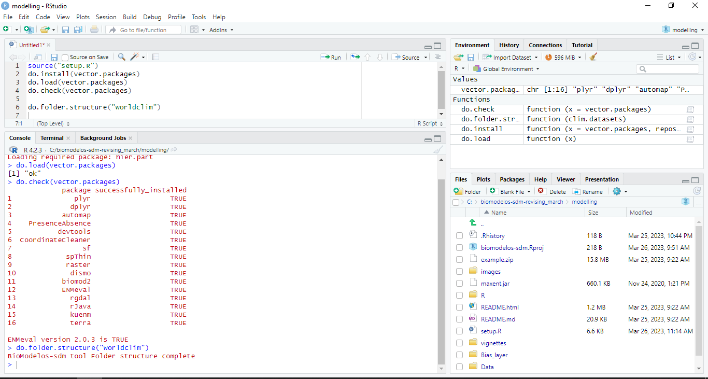

```{r setup, include=FALSE}
knitr::opts_knit$set(root.dir = "C:/humboldt/biomodelos-sdm/modelling")
```

# biomodelos-sdm tool
### July 14th, 2023

## What is the biomodelos-sdm tool?

This tool stores functions to automate the construction of Species Distribution Models (SDM). These functions utilize an automated and versatile SDM general routine that comprises several steps. Firstly, they format occurrence data as required and create geographic areas for training and projecting models if desired. Secondly, they crop and mask environmental variables for both current and future conditions. Thirdly, the functions train SDMs using one or more algorithms and assess their performance quantitatively. Finally, the best models are combined using an ensemble approach, and projections can be made for various scenarios as desired.

# Setup

## Prerequisites

Before installing and using biomodelos-sdm tool, please ensure that your computer meets the following minimum system requirements:

1. Operating System: Windows 7 or later (Windows 8, Windows 10, etc.). Please note that biomodelos-sdm tool is not compatible (yet) with Mac or Linux operating systems.

2. Memory (RAM): Your computer should have a minimum of 8 GB of RAM. However, for optimal performance, we recommend having 16 GB or more.

3. User Permissions: To install and run biomodelos-sdm tool, you need to have administrator user permissions on your computer. This is necessary to ensure that the software can access all the required system resources and functions seamlessly.

4. Optional, GIS Software: QGIS (version 3.0 or higher) or ArcGIS (ArcMap or ArcGIS Pro).

 - QGIS: It is an open-source and free GIS software that provides a user-friendly interface and many features for geospatial data analysis and visualization.
 - ArcGIS: It is an industry-leading GIS software developed by Esri. It offers a wide range of tools and functionalities for advanced analysis and visualization of geospatial data.
 
Ensuring that your computer meets these system requirements will guarantee a smooth installation and usage experience with biomodelos-sdm tool. If you have any questions or encounter any issues during the setup process, please contact our support team for assistance.

### Dependencies and files

Dependencies to install, choose the version depending on your operating system and version. For example, a windows 10 terminal with more than 4 gigabytes on memory RAM almost always has a 64 bit version of windows. Surf on the web in case of more information.

* [R](https://cran.r-project.org/mirrors.html) version 4.1.0 to 4.2.3 (4.3 or upper needs updating)
* [RStudio](https://www.rstudio.com/products/rstudio/download/#download) version 1.4 or upper
* [Rtools](https://cran.r-project.org/bin/windows/Rtools/) version 4.0 or upper, choose an appropiate one for your R version
* [Java Development Kit](https://www.oracle.com/java/technologies/javase/javase-jdk8-downloads.html) version 8.0 or upper
* [Maxent](https://biodiversityinformatics.amnh.org/open_source/maxent/) version 3 or upper
* The [biomodelos-sdm](https://github.com/PEM-Humboldt/biomodelos-sdm) repository

### Libraries
Libraries required and their versions

```
"plyr" version 1.8.6
"dplyr" version 1.0.5
"automap" version 1.0.14
"PresenceAbsence" version 1.1.9
"devtools" version 2.3.2
"CoordinateCleaner" version 2.0.18
"sf" version 0.9.8
"spThin" version 0.2.0
"raster" version 3.4.10
"dismo" version 1.3.3
"biomod2" version 3.4.6
"ENMeval" version 2.0.3
"rgdal" version 1.5.23
"rJava" version 0.9.13
"kuenm" version 1.1.6
```

## How to run

1. Download and uncompress the content of this repository (biomodelos-sdm) and "maxent.jar" file (downloaded previously) there. For better results choose a root directory like "C" or "D" in windows to move the folder (working directory).

2. Open RStudio and open the project: biomodelos-sdm.Rproj inside the modelling folder of the repository. It can be achieving doing the next. First, click on tool bar "File" (upper left of the RStudio window). Second, "Open Project". In the opened window, browse into the computer folder structure until reach the folder uncompressed before in the step 1 and go to the folder "biomodelos-sdm/modelling/". *Note: For a bit more experimented users, this step is comparative to setup a working directory with* `setwd()` at the cited folder.

3.  Create in RStudio a new script. It can be achieve going to "File" tool bar, "New File" and then "R Script". It may well be used the icon "New file" right under the tool bar "File" or using the keyboard shortcut "Ctrl+Shift+N" in windows.

4. Load the setup function store in the **biomodelos-sdm/modelling/**. Type in the script editor:

```{r}
source("setup.R")
```

5. Then run it using the icon "Run" or the keyboard shortcut "Ctrl+Enter" in windows. You will find four new objects in the environment (upper left portion of the RStudio window)
+ *vector.packages* vector character that stores the name of each package necessary to run the **biomodelos-sdm** tool
+ *do.install* automatic installation of needed packages
+ *do.check* function to verify if the installation of vector packages was successful
+ *do.load* automatic loading of needed packages
+ *do.folder.structure* function to create folders to organize work process in the working directory.

6. Run the automatic installation in the editor script. The process will install the packages stored in the 'vector.packages' object. In case of asking for a compilation window procedure accept it, this will diminish chances of installation errors, it is slower than a traditional method, so be patient. Warning: if you have a version of ENMeval package lower or higher than 2.0.3 it will be replace by the former.

```{r, eval=FALSE}
do.install(vector.packages)
```
You only need to install the packages once, so, it is better to block this command line typing a '#' character in the forefront of the line just before of the first run, like this `# do.install(vector.packages)` or even erase the line.

7. Verify if packages were successfully installed using

```{r}
do.check(vector.packages)
```

A message showing a table with column names "package" and "successfully_completed" will be shown in the console (corner left of the RStudio window), as well as the ENMeval version installed. For example,

```
             package successfully_installed
1               plyr                  TRUE
2              dplyr                  TRUE
3            automap                  TRUE
4    PresenceAbsence                  TRUE
5           devtools                  TRUE
6  CoordinateCleaner                  TRUE
7                 sf                  TRUE
8             spThin                  TRUE
9             raster                  TRUE
10             dismo                  TRUE
11           biomod2                  TRUE
12           ENMeval                  TRUE
13             rgdal                  TRUE
14             rJava                  TRUE
15             kuenm                  TRUE

ENMeval version 2.0.3 is TRUE
```

In case of receiving a FALSE statement on the table or having an ENMeval version different to 2.0.3, you need to troubleshoot before to continue. Please refer to the vignettes and installation manual of each problematic package: [kuenm](https://github.com/marlonecobos/kuenm), [enmeval](https://www.bing.com/search?q=enmeval+github&qs=n&form=QBRE&sp=-1&lq=0&pq=enmeval+github&sc=6-14&sk=&cvid=F714530DD0334E67862BCDB5962C6426&ghsh=0&ghacc=0&ghpl=), etc. Then re-run `do.check(vector.packages)`

8. Load the installed packages with

```{r, message = FALSE}
do.load(vector.packages)
```

9. Create the structure of folders typing and run.

```{r, eval = FALSE}
do.folder.structure(clim.datasets = "worldclim")
```

The use of the character "worldclim"" inside the function does not refer to retrieve the data from the repository. It is only a way to create an organized a framework inside the working directory in which you may store the environmental variables and occurrence data of species downloaded manually or using automatized tools.

After run the function you will have in your working directory 3 new folders with subfolders:

* *Bias_layer* to storage bias file layers created (please refer to [this article](https://onlinelibrary.wiley.com/doi/10.1111/j.1600-0587.2013.07872.x) and this [blog](https://scottrinnan.wordpress.com/2015/08/31/how-to-construct-a-bias-file-with-r-for-use-in-maxent-modeling/))
* *Data* to storage geographical data. Sub-folders:
  + *biogeographic_shp* storage geographical objects in order to compute or calculate interest areas of study, for example biogeographic, ecoregions or hydrosheets shapefiles. It would be useful to storage areas odf interes for individual species.
  + *env_vars* to storage environmental variables. Most used files can be ".tif" or ".asc". Supported file types are the 'native' for raster and terra package format and those that can be read via [rgdal](https://www.rdocumentation.org/packages/rgdal/versions/1.5-23/topics/readGDAL). Warning: we are working on pdate spatial functions relying on rgdal, rgeos, sp and raster to geos, sf and terra. Sub-folders:
    + *other* environmental variables not related with climate but consider important to modeled species
      + *future*
      + *current*
    + *climatic* climatic variables consider important to modeled species
      + *future*
      + *current*
* *Occurrences* to storage geographical records of species, those records must have a column with name species, latitude and longitude in decimal format

10. Load the wrapper function "fit_biomodelos". This function follows the basic structure of an "Ecological Niche Modeling" (ENM) process (Peterson et al, 2011). It calls several subroutines to achieve this with a few inputs and having a wide range of customization.

```{r}
source("R/fit_biomodelos.R")
```

### Folder structure and RStudio window

Your folder structure must look like this:



Your RStudio window must look like this:



Now you are ready to customize the biomodelos-sdm tool and run SDM models. As mentioned earlier, you will require two additional fundamental components: environmental variables and georeferenced occurrence data for one or multiple species. We strongly recommend following the subsequent section, which outlines the structure and attributes of these elements, along with essential information to guide you through the execution and understanding of this application. Throughout various practical examples, we will model the distribution of five endemic bird species in Colombia, utilizing both the standard methods and selected advanced features of this tool to enhance your proficiency. Also, you will learn about the theory and logic shown by this software step by step.  

## References and packages

Kramer-Schadt, S., Niedballa, J., Pilgrim, J.D., Schröder, B., Lindenborn, J., Reinfelder, V., Stillfried, M., Heckmann, I., Scharf, A.K., Augeri, D.M., Cheyne, S.M., Hearn, A.J., Ross, J., Macdonald, D.W., Mathai, J., Eaton, J., Marshall, A.J., Semiadi, G., Rustam, R., Bernard, H., Alfred, R., Samejima, H., Duckworth, J.W., Breitenmoser-Wuersten, C., Belant, J.L., Hofer, H. and Wilting, A. (2013), The importance of correcting for sampling bias in MaxEnt species distribution models. Diversity Distrib., 19: 1366-1379. https://doi.org/10.1111/ddi.12096

Peterson, A., Soberón, J., G. Pearson, R., Anderson, R., Martínez-Meyer, E., Nakamura,M., y Araújo, M. (2011) Ecological Niches and Geographic Distributions, tomo 49.  360 pp.

Velásquez-Tibata,  J. I., Olaya-Rodríguez, M. H., López-Lozano, D. F., Gutierrez, C., Gonzales, I., & Londoño-Murcia, M. C. 2019. Biomodelos: a collaborative online system to map species distributions. Plos One, 14(3), e0214522.  https://doi.org/10.1371/journal.pone.0214522

### Packages

Aiello-Lammens, M. E., Boria, R. A., Radosavljevic, A. , Vilela, B. and Anderson, R. P.   (2015). spThin: an R package for spatial thinning of species occurrence records for use in ecological niche models. Ecography, 38: 541-545. URL https://onlinelibrary.wiley.com/doi/10.1111/ecog.01132.

Cobos ME, Peterson AT, Barve N, Osorio-Olvera L. (2019) kuenm: an R package for detailed development of ecological niche models using Maxent PeerJ, 7:e6281 URL http://doi.org/10.7717/peerj.6281

Freeman, E. A. and Moisen, G. (2008). PresenceAbsence: An R Package for Presence-Absence Model Analysis. Journal of Statistical Software, 23(11):1-31. http://www.jstatsoft.org/v23/i11

Hadley Wickham (2011). The Split-Apply-Combine Strategy for Data Analysis. Journal of Statistical Software, 40(1), 1-29. URL http://www.jstatsoft.org/v40/i01/

Hadley Wickham, Jim Hester and Winston Chang (2021). devtools: Tools to Make Developing R  Packages Easier. R package version 2.4.2. https://CRAN.R-project.org/package=devtools

Hadley Wickham, Romain François, Lionel Henry and Kirill Müller (2021). dplyr: A Grammar of Data Manipulation. R package version 1.0.7. https://CRAN.R-project.org/package=dplyr

Hiemstra, P.H., Pebesma, E.J., Twenhofel, C.J.W. and G.B.M. Heuvelink, 2008. Real-time
automatic interpolation of ambient gamma dose rates from the Dutch Radioactivity
Monitoring Network. Computers & Geosciences, accepted for publication.

Muscarella, R., Galante, P.J., Soley-Guardia, M., Boria, R.A., Kass, J., Uriarte, M. and R.P. Anderson (2014). ENMeval: An R package for conducting spatially independent evaluations and estimating optimal model complexity for ecological niche models. Methods in Ecology and Evolution.

Osorio-Olvera L., Lira‐Noriega, A., Soberón, J., Townsend Peterson, A., Falconi, M., Contreras‐Díaz, R.G., Martínez‐Meyer, E., Barve, V. and Barve, N. (2020), ntbox: an R package with graphical user interface for modeling and evaluating multidimensional ecological niches. Methods Ecol Evol. 11, 1199–1206. doi:10.1111/2041-210X.13452. https://github.com/luismurao/ntbox

Pebesma, E., 2018. Simple Features for R: Standardized Support for Spatial Vector Data. The R Journal 10 (1), 439-446, https://doi.org/10.32614/RJ-2018-009

Robert J. Hijmans, Steven Phillips, John Leathwick and Jane Elith (2020). dismo: Species Distribution Modeling. R package version 1.3-3. https://CRAN.R-project.org/package=dismo

Robert J. Hijmans (2021). raster: Geographic Data Analysis and Modeling. R package version 3.4-13. https://CRAN.R-project.org/package=raster

Roger Bivand, Tim Keitt and Barry Rowlingson (2021). rgdal: Bindings for the 'Geospatial' Data Abstraction Library. R package version 1.5-23. https://CRAN.R-project.org/package=rgdal

Simon Urbanek (2021). rJava: Low-Level R to Java Interface. R package version 1.0-4. https://CRAN.R-project.org/package=rJava

Thuiller Wilfried ; Georges Damien; Gueguen Maya; Engler Robin and Breiner Frank (2021). biomod2: Ensemble Platform for Species Distribution Modeling. R package version 3.5.1. https://CRAN.R-project.org/package=biomod2

Zizka A, Silvestro D, Andermann T, Azevedo J, Duarte Ritter C, Edler D, Farooq H, Herdean
A, Ariza M, Scharn R, Svanteson S, Wengstrom N, Zizka V, Antonelli A (2019).
“CoordinateCleaner: standardized cleaning of occurrence records from biological collection
databases.” _Methods in Ecology and Evolution_, -7. doi: 10.1111/2041-210X.13152 (URL:
https://doi.org/10.1111/2041-210X.13152), R package version 2.0-18, <URL:
https://github.com/ropensci/CoordinateCleaner>.

## Authors and contact

* **Carlos Jair Muñoz Rodriguez, [corporate mail](mailto:cmunoz@humboldt.org.co), [personal mail](mailto:cmunozbiol@gmail.com)**
* **Elkin Alexi Noguera Urbano, [corporate mail](mailto:enoguera@humboldt.org.co), [personal mail](mailto:elkalexno@gmail.com)**

## Collaborators

* **María Helena Olaya, [corporate mail](mailto:molaya@humboldt.org.co ), [personal mail](mailto:olaya42@gmail.com)**

* **Gabriel Alejandro Perilla Suarez, [corporate mail](mailto:gperilla@humboldt.org.co), [personal mail](mailto:thealejandroperilla@gmail.com)**

* **Héctor Manuel Arango Martínez, [corporate mail](mailto:harango@humboldt.org.co), [personal mail](hma9327@gmail.com)**

* **Cristian Alexander Cruz Rodriguez, [corporate mail](mailto:ccruz@humboldt.org.co), [personal mail](cruzrodriguezcristian@gmail.com)**

* **Luis Hernando Romero Jiménez, [corporate mail](mailto:lromero@humboldt.org.co), [personal mail](mailto:lhromeroj@gmail.com)**

* **Andrés Felipe Suárez Castro, [personal mail](mailto:felipesuarezca@gmail.com)**

## Acknowledgment

*This development is supported by National Geographic Society Grant number NGS-86896T-21, project "Developing an integrated species distribution modelling system to identify complementary conservation areas in Colombia". [Project information](https://explorer-directory.nationalgeographic.org/elkin-a-noguera-urbano)**
* Initial phases of the project were supported by Natural map.

## License

This project is licensed under the MIT License - see the [License](https://github.com/PEM-Humboldt/biomodelos-sdm/blob/master/License.md) file for details.