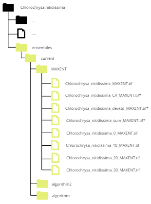

```{r setup, include=FALSE}
knitr::opts_knit$set(root.dir = "C:/humboldt/biomodelos-sdm/modelling")
```

[ENGLISH](https://biomodelos.github.io/tallerNatGeo/working-example-1.html) []( https://biomodelos.github.io/tallerNatGeo/working-example-1.html) |  [SPANISH]( https://biomodelos-github-io.translate.goog/tallerNatGeo/working-example-1.html?_x_tr_sl=en&_x_tr_tl=es&_x_tr_hl=en-US&_x_tr_pto=wapp  )  []( https://biomodelos-github-io.translate.goog/tallerNatGeo/working-example-1.html?_x_tr_sl=en&_x_tr_tl=es&_x_tr_hl=en-US&_x_tr_pto=wapp  )

# Working Example 1: large number of occurrence records

Species distribution models (SDMs) are computational models used to predict the potential geographic distribution of species based on environmental variables. These models aim to establish relationships between the observed occurrence records of a species and environmental factors, such as temperature, precipitation, elevation, and land cover, for that reason are called correlative models. By analyzing the known occurrences of a species in relation to these environmental variables, SDMs can then generate predictions about where the species is likely to occur in areas where observations are lacking.

SDMs employ various statistical and machine learning techniques to create predictive models. These models can be used to understand the ecological requirements and habitat preferences of species, identify areas of high species richness or biodiversity, assess the potential impacts of climate change on species distributions, and inform conservation and management strategies. The input data for SDMs typically include species occurrence records (presence or absence data) and spatially explicit environmental data layers. The models use these data to characterize the ecological niche of a species and generate maps or spatial predictions of its potential distribution across a given geographic area.

biomodelos-sdm tool is designed to help and automatize this process. Stay tune to understand the initial mechanisms and logic behind this application.

## Environmental Data and Ocurrences

Extract the files inside of the ".zip" folder *example* to the main root folder. It will write a folder called *example* having three other folders: *Bias_file*, *Data*, and *Occurrences*.

 - *Data* folder, where you will find 
    - *env_vars* environmental variables  representing climatic and other factors of current and future scenarios. The resolution of this layers are 10 km.
      - *other* folder to store environmental variables no related to climatic factors like topographic or remote sensing data. 
      - *worldclim* folder to store climatic variables, in this case the data come from the [worldclim](https://www.worldclim.org/) database 
    - *biogeographic_shp* useful biogeographic shapes in order to be used as template for training models or select areas of interest.

 - *Occurrences* folder, you will find several spreadsheets in ".csv" format. Each ".csv" stores occurrence data of birds and each one has column labels "species", "lon" and "lat".

In this example, we are going to run a simple ENM of a single species database, a colorful bird species, the Multicolored Tanager or *[Chlorochrysa nitidissima](https://ebird.org/species/multan1)*. 

First, we are going to call some libraries

```{r, message=F, warning=F}
library(maps)
library(dplyr)
library(ggplot2)
library(sf)
library(terra)
```

So, load the "single_species.csv" file.

```{r}
dataSp <- read.csv("example/Occurrences/single_species_1.csv")
View(dataSp)
```

Explore the dataSp object

```{r}
names(dataSp)
nrow(dataSp)
ncol(dataSp)
```

Check the structure of the database
```{r}
head(dataSp)
```

Let's go to explore spatially the dataSp object. First load the continental Colombian borders

```{r}
col <- read_sf("example/Data/biogeographic_shp/nacional_wgs84.shp")
```

Second, convert the dataSp plain database to a geographical object

```{r}
dataSp.points <- dataSp |>
  st_as_sf(coords = c("lon", "lat"), crs = st_crs("EPSG:4326"))
```

Plot both objects

```{r}
ggplot() + 
    geom_sf(data = col, fill = "transparent", color = "black") +
    geom_sf(data = dataSp.points, color = "darkblue")
```

Before we proceed, let's take a closer look at some environmental variables. These variables have been obtained from the [worldclim](https://www.worldclim.org/data/worldclim21.html) database, specifically from the "Bioclimatic" set. The worldclim database, accessible at worldclim.org, provides valuable climatic data for research purposes.

Bioclimatic variables are derived from monthly temperature and rainfall data, and their purpose is to capture biologically significant information. By analyzing these variables, we can gain insights into annual trends, seasonality patterns, and extreme environmental conditions. These variables are particularly useful in species distribution modeling and ecological research. For more detailed information on bioclimatic variables, you can explore the [bioclim](https://www.worldclim.org/data/bioclim.html) section of the worldclim website.

```{r}
env_r <- list.files("example/Data/env_vars/worldclim/current/", recursive = T, full.names = T) |> 
  rast()
plot(env_r)
```

The variables are rasters. A raster is a type of data structure commonly used in geographic information systems (GIS) and remote sensing. It represents spatial information as a grid of cells or pixels, where each cell contains a value that represents a specific attribute or characteristic. Think of a raster as a digital image or a grid-like map, where each cell corresponds to a small area on the ground. Each cell has a value that could represent various things, such as elevation, temperature, land cover type, or any other measurable quantity.

Explore the object which stores the variables

```{r}
env_r
```


## Running

Once the species occurrence data and environmental variables are prepared, the next step involves customizing and running the fit_biomodelos() function. This function serves as the core tool in biomodelos-sdm and allows for the setup and loading of required packages. 

```{r, message=FALSE, warning=FALSE}
source("setup.R")
do.load(vector.packages)
```

Load the core function fit_biomodelos

```{r}
source("R/fit_biomodelos.R")
```

In this specific example, we are going to use:

```{r, eval = FALSE}
fit_biomodelos(
  occ = dataSp, col_sp = "species", col_lat = "lat",
  col_lon = "lon", clim_vars = "worldclim", dir_clim = "example/Data/env_vars/",
  dir_other = "example/Data/env_vars/other/", method_M = "points_buffer", dist_MOV = 74,
  proj_models = "M-M", remove_distance = 10, remove_method = "spthin", selection = "aic",
  fc_large_sample = "lqhp", algo_enmeval = "maxnet"
)
closeAllConnections()

```

Here is a brief explanation of each argument:

+ occ: The species occurrence database is referred to as dataSp (previously loaded database).
+ col_sp: The column name in the database containing the species information is "species".
+ col_lon: The column name in the database containing the longitude information is "lon".
+ col_lat: The column name in the database containing the latitude information is "lat".
+ clim_vars: The name of the climatic variables is "worldclim". The function will search for these variables in the specified directory path.
+ dir_clim: The climatic directory is located at "Data/env_vars/".
+ dir_other: The non-climatic variables are located in "Data/env_vars/other/".
+ proj_models: The niche models will be calibrated and projected in the accessible area, indicated by "M-M".
+ method_M: makes reference to what metodology is selected to construct the accesible area or M, it is constructed as a buffer around each occurrence point with a buffer according to a movement distance "points_buffer". 
+ dist_MOV: The movement distance used for constructing the accessible area buffer is 74 kilometers.
+ remove_method: management of sample bias through removing occurrences to avoid over-representation of certain environmental features of the more accessible and extensively surveyed areas. In this case the algorithm [spthin](https://onlinelibrary.wiley.com/doi/epdf/10.1111/ecog.01132) is used.
+ remove_distance: distance in kilometers to be used as threshold in the removing spatial duplicates process, 10 kilometers was used to let only one occurrence per pixel.

Let's explore the thinned and density of occurrence data after processing and the interest area used

```{r}
aoi <- read_sf("Chlorochrysa.nitidissima/interest_areas/shape_M.shp")

data_thinned <- read.csv("Chlorochrysa.nitidissima/occurrences/removed_spat_occ.csv")
data_thinned <- data_thinned |>
  st_as_sf(coords = c("lon", "lat"), crs = st_crs("EPSG:4326"))

ggplot() + 
    geom_sf(data = col, fill = "transparent", color = "black") +
    geom_sf(data = aoi, fill = "transparent", color = "black") +
    geom_sf(data = data_thinned, fill = "transparent", color = "black")
```

Finally, the species distribution model. It is important to note that although the environmental variables used in the model cover the entire neotropic region, the model itself is constructed and projected only within the defined interest area or M (controlled by the method_M argument). The biomodelos-sdm tool offers various methods to define and create the interest area, providing flexibility and customization options. Stay tuned to explore and learn more about these methods and how they can be utilized in your analysis. Lets plot the species distribution model in a continuous scale.

```{r}
models <- list.files("Chlorochrysa.nitidissima/ensembles/current/MAXENT/", full.names = T)[ 9 ] |>
  rast() |> 
  crop(col)

plot(models)
plot(vect(col), add= T)
```

Now, the species distribution model in a binary scale or threshold map using as cutoff the percentile 10 of occurrence data

```{r}
models <- list.files("Chlorochrysa.nitidissima/ensembles/current/MAXENT/", full.names = T)[ 3 ] |>
  rast() |> 
  crop(col)

plot(models)
plot(vect(col), add= T)
```

## Checking console messages and working directory folder

Once you run the last script, you would monitor the process in the console (left down in RStudio) and the working directory folder. In the next table we show how the function works. Each row represents a working step (from zero 0 to 6) that is explained in the column "Action in progress" and you will find what messages are displayed in the RStudio console and how your working directory looks. It would be useful explore your species folder inside the root folder.

<style>
  td:nth-child(3) {
    text-align: center;
    font-weight: bold;
    font-style: italic;
  }
</style>

<table>
  <tr>
    <th style="width: 10%;">Step</th>
    <th style="width: 40%;">Action in progress</th>
    <th style="width: 10%;">Console message</th>
    <th style="width: 40%;">Working folder</th>
  </tr>
  <tr>
    <td>0</td>
    <td>Just after running, the routine creates a species folder in the working directory. Inside the last, it sets up a temporary folder for raster files processing (Temp), occurrences by species, and a log file. The log file is used to save the parameters given to the function and make possible to track and reproduce the modeling process. You are allowed to see the content of the log file at the end of the process.</td>
    <td>Preparing folders and files</td>
    <td></td>
  </tr>
  <tr>
    <td>1</td>
    <td>Formatting records from the database. In a first moment the routine searches missing coordinates or having strange characters. Then, it removes columns not useful for the following steps</td>
    <td>formating data</td>
    <td></td>
  </tr>
  <tr>
    <td>2</td>
    <td>Spatial thinning of occurrence records in a way to diminish the bias sample and make the process more efficient. Here, by default the function uses <a href="https://cran.r-project.org/web/packages/spThin/spThin.pdf">spThin</a> <a href="https://github.com/luismurao/ntbox/blob/master/R/clean_dup.R">clean_dup</a>, but it can be customized to run <a href="https://github.com/luismurao/ntbox/tree/master/R">ntbox</a>.</td>
    <td>Removing spatial duplicate occurrences database to 10km</td>
    <td></td>
  </tr>
  <tr>
    <td>3</td>
    <td>Constructing research areas or accessible areas in which the algorithm(s) selected will be trained, or projected in current or future scenarios. In this way, <em>fit_biomodelos</em> has several options to construct them. Those are called "Interest areas". Please see <a href="vignettes/fit_biomodelos.md">fit_biomodelos</a> article.</td>
    <td>Constructing interest areas</td>
    <td></td>
  </tr>
  <tr>
    <td>4</td>
    <td>Cropping and masking the environmental variables, either be current or future ones. It also stores them temporally in a folder call M (or G in case of transferring/projecting the model to other areas)</td>
    <td>Processing environmental layers</td>
    <td></td>
  </tr>
  <tr>
    <td>Opt</td>
    <td>Cropping and masking the bias layer constructed by the user to accessible area extent</td>
    <td>Processing bias layer</td>
    <td></td>
  </tr>
  <tr>
    <td>5</td>
    <td>Running algorithms chosen and evaluating them. Supported algorithms include bioclim (from dismo) and Maxent (BIOMOD2 was deprecated since version 1.0.2). In the current version both bioclim setup and Maxent hyperparameters are tuned, using dismo for the former and <a href="https://cran.r-project.org/web/packages/ENMeval/index.html">ENMeval</a> or <a href="https://github.com/marlonecobos/kuenm">Kuenm</a> for the latter. Bioclim is run only if there are less than six occurrence records of a species, otherwise other algorithm is run following the next rule: if there are less than 20 occurrence species records a jackknife procedure is performed and run by Maxent, by the other side the models are tuned using blocks and run Maxent. Evaluation of models depends on a hierarchical selection of best Partial Roc, Akaike Information Criterion, and the lowest omission rate at user discretion percentile (default 10th).</td>
    <td>Calibrating and evaluating SDM's</td>
    <td></td>
  </tr>
  <tr>
    <td>6</td>
    <td>Ensembling the best models of each algorithm type. A median, coefficient of variation, standard deviation and sum are calculated, those measures are not performed if only one model is selected. 4 threshold-type maps are calculated from the median or unique model: minimum threshold presence, ten threshold percentile, twenty threshold percentile and thirty threshold according to <a href="http://biomodelos.humboldt.org.co/">Biomodelos framework</a>.</td>
    <td>Calculating ensembles</td>
    <td></td>
  </tr>
  <tr>
    <td>7</td>
    <td>Removing temporal files. The final number, class and type of files is controlled by the argument <em>remove_files</em>. Please, see documentation.</td>
    <td></td>
    <td></td>
  </tr>
  <tr>
    <td>8</td>
    <td>Close log file and ending execution.</td>
    <td>[1] "ok. Chlorochrysa.nitidissima"</td>
    <td></td>
  </tr>
</table>

 
### Questions

Try to change the default settings and train an species distribution model using a minimum convex polygon with a buffer of 25 kilometers and remove occurrence data with another method, please go to [fit_biomodelos](vignettes/fit_biomodelos.md) for more information.

<details>
  <summary>Answer</summary>
  
  <code>
  fit_biomodelos(
    occ = dataSp, col_sp = "species", col_lat = "lat",
    col_lon = "lon", clim_vars = "worldclim", dir_clim = "example/Data/env_vars/",
    dir_other = "example/Data/env_vars/other/", method_M = "polygon_points_buffer", dist_MOV = 25,
    proj_models = "M-M", remove_distance = 10, remove_method = "sqkm"
  )
  </code>

</details>

## References

Cobos ME, Peterson AT, Barve N, Osorio-Olvera L. (2019) kuenm: an R package for detailed development of ecological niche models using Maxent PeerJ, 7:e6281 URL http://doi.org/10.7717/peerj.6281

Muscarella, R., Galante, P.J., Soley-Guardia, M., Boria, R.A., Kass, J., Uriarte, M. and R.P. Anderson (2014). ENMeval: An R package for conducting spatially independent evaluations and estimating optimal model complexity for ecological niche models. Methods in Ecology and Evolution.

Peterson, A., Soberón, J., G. Pearson, R., Anderson, R., Martínez-Meyer, E., Nakamura,M., y Araújo, M. (2011) Ecological Niches and Geographic Distributions, 49.  360 pp.

Peterson, A., Soberón, J., G. Pearson, R., Anderson, R., Martínez-Meyer, E., Nakamura,M., y Araújo, M. (2011) Ecological Niches and Geographic Distributions, tomo 49.  360 pp.

Thuiller Wilfried ; Georges Damien; Gueguen Maya; Engler Robin and Breiner Frank (2021). biomod2: Ensemble Platform for Species Distribution Modeling. R package version 3.5.1. https://CRAN.R-project.org/package=biomod2

Zizka A, Silvestro D, Andermann T, Azevedo J, Duarte Ritter C, Edler D, Farooq H, Herdean
A, Ariza M, Scharn R, Svanteson S, Wengstrom N, Zizka V, Antonelli A (2019).
“CoordinateCleaner: standardized cleaning of occurrence records from biological collection
databases.” _Methods in Ecology and Evolution_, -7. doi: 10.1111/2041-210X.13152 (URL:
https://doi.org/10.1111/2041-210X.13152), R package version 2.0-18, <URL:
https://github.com/ropensci/CoordinateCleaner>.

