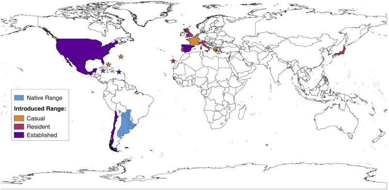

```{r setup, include=FALSE}
knitr::opts_knit$set(root.dir = "C:/humboldt/biomodelos-sdm/modelling")
```

# Working Example 3: projecting to different spatial extent

Projecting species distribution models to different geographic extents is a fundamental step in understanding the potential distribution of species in new or future environments. By applying the models developed for one geographic region to other areas, we can gain insights into how species might respond to changing environmental conditions or expand their ranges.

Furthermore, projecting species distribution models to different geographic extents allows us to identify areas that may be suitable for species introduction or conservation efforts. By understanding the potential distribution of a species in new regions, conservationists can make informed decisions about habitat restoration, species reintroduction, the establishment of protected areas, forecasting biological invasions, identifying priority conservation areas for rare or threatened species, assessing climate change risks, and understanding the ecological processes driving species diversification (Rödder et al, 2009; Rodda et al, 2011; Warren et al, 2014; Acevedo et al, 2014;   Breiner et al, 2015).

In this example, we are going to work with occurrences of the Monk Parakeet or *[Myiopsitta monachus](https://ebird.org/species/monpar?siteLanguage=en)*. Originating from South America, particularly Argentina, this bird species has successfully established populations in various parts of the world, including North America, Europe, and Asia. The invasion process of *Myiopsitta monachus* is characterized by its adaptability and resilience in colonizing new habitats (Strubbe and Matthysen, 2017). The species' invasive success can be attributed to several factors. *Myiopsitta monachus* is highly adaptable to different environments, capable of thriving in urban, suburban, and agricultural landscapes. They exhibit generalist feeding behavior, consuming a wide range of food sources, including fruits, seeds, and agricultural crops . Additionally, their communal nesting habits and ability to construct large, elaborate nests in trees, buildings, and utility structures provide them with shelter and protection, further aiding their establishment in new areas (Davis, Malas and Minor, 2014).

<div style="text-align: center;">
  
</div>


The impacts of **Myiopsitta monachus** invasions can be both positive and negative. While they contribute to biodiversity by establishing new populations and adding to avian diversity, they can also cause conflicts with humans. Their large communal nests can damage infrastructure, such as power lines, and their feeding habits may result in crop damage (Reed et al, 2014). Furthermore, they can outcompete native bird species for resources and potentially disrupt local ecosystems (Simberloff, 2014).

The question at hand is whether Colombia provides suitable habitat for the Monk Parakeet.

## Environmental Data and Ocurrences

If you skip the last section, extract the files inside of the ".zip" folder *example* to the main root folder. It will write a folder called *example* having three other folders: *Bias_file*, *Data*, and *Occurrences*.

 - *Data* folder, where you will find 
    - *env_vars* environmental variables  representing climatic and other factors of current and future scenarios. The resolution of this layers are 10 km.
      - *other* folder to store environmental variables no related to climatic factors like topographic or remote sensing data. 
      - *worldclim* folder to store climatic variables, in this case the data come from the [worldclim](https://www.worldclim.org/) database 
    - *biogeographic_shp* useful biogeographic shapes in order to be used as template for training models or select areas of interest.

 - *Occurrences* folder, you will find several spreadsheets in ".csv" format. Each ".csv" stores occurrence data using three columns called "species", "lon" and "lat". Go to last section for more information. 

First, we are going to call some libraries

```{r, message=F, warning=F}
library(maps)
library(dplyr)
library(ggplot2)
library(sf)
```

Then, load the occurrences.

```{r}
dataSp <- read.csv("example/Occurrences/single_species_3.csv")
View(dataSp)
```

We need to remove the records without coordinate data a it is not useful for this analysis

```{r}
dataSp <- filter(dataSp, !is.na(decimalLongitude), !is.na(decimalLatitude))
```

Now, explore the dataSp object. *Notice the change in column names*.

```{r}
names(dataSp)
nrow(dataSp)
ncol(dataSp)
```

Plot the occurrences. To accurately plot the occurrences of the Monk Parakeet, it is essential to use shapefiles that represent the species' native distribution. These shapefiles will provide the necessary geographical boundaries to create an accurate and informative map.

So, lets retrieve a world map

```{r}
world1 <- st_as_sf(map(database = 'world', plot = FALSE, fill = TRUE))
```

and plot the occurrences

```{r}
dataSp.points <- dataSp |>
  st_as_sf(coords = c("decimalLongitude", "decimalLatitude"), crs = st_crs("EPSG:4326"))
ggplot() + 
    geom_sf(data = world1) +
    geom_sf(data = dataSp.points, color = "blue")
```


## Running

Call the biomodelos-sdm setup and load packages 

```{r, message=FALSE, warning=F}
source("setup.R")
do.load(vector.packages)
```

Load the core function fit_biomodelos

```{r}
source("R/fit_biomodelos.R")
```

The chunk code for this example is 

```{r, eval = FALSE}
fit_biomodelos(
  occ = dataSp, col_sp = "species", col_lat = "decimalLatitude",
  col_lon = "decimalLongitude", clim_vars = "worldclim", dir_clim = "example/Data/env_vars/",
  dir_other = "example/Data/env_vars/other/", method_M = "points_MCP",
  proj_models = "M-G", remove_distance = 10, remove_method = "spthin", 
  area_G ="example/Data/biogeographic_shp/nacional_wgs84.shp", extrapo = "no_ext", compute_G = T,
  fc_large_sample = c("l", "q", "lq"), beta_large_sample = c(1, 1.5, 2)
)

```

Here is a brief explanation of new the arguments. *In order to save space, those revised or equal to the working example 1 will be override.

 - proj_models: it would be "M-M" or "M-G".The parameter specifies if the training area is the same as the projection area. M area can be define as the accessible area in which algorithm is trained, G area in which is going to be projected the trained model in current time or same as M.
 - ext: extrapolation type of projections following kuenm_mod; can be: "all" (all three of the options listed), "ext_clam" (extrapolation with clamping), "ext" (free extrapolation), and "no_ext" (no extrapolation).
 - area_G: file path to the raster or shape file defining the M area, in case of not using any optional method, i.e an user pre-processed area to train ecological niche models. It is used if compute_G is set to TRUE and proj_models is "M-G".
 - compute_G: value indicating whether to compute environmental data for the "G" projection area. It can be useful if the user have pre-processed G environmental variables which are stored in a folder.

In order to gain a better understanding of the concepts of calibration and projection, we will visualize three key components: the area of interest or M, the projection area, and the final model surface. This visualization will provide a clearer picture of how these components relate to each other in the context of species distribution modeling


 - The Area of Interest (**M**) represents the specific region where the model is calibrated, typically based on available occurrence data and relevant environmental factors. This localized calibration allows the model to capture species-environment relationships specific to the chosen area. 

```{r}
aoi <- read_sf("Myiopsitta.monachus/interest_areas/shape_M.shp")
```

 - The projection area (**G**)extends beyond the Area of Interest and represents the broader geographic extent where the model's predictions are extrapolated.

```{r}
aop <- read_sf("Myiopsitta.monachus/interest_areas/shape_G.shp")
```

And now, plot both areas

```{r}
ggplot() + 
    geom_sf(data = world1) +
    geom_sf(data = aoi, fill = "yellow") +
    geom_sf(data = aop, fill = "blue")
```

 - By visualizing the final model surface, we can observe how the calibrated model is projected onto the projection area, generating a spatial representation of the species distribution. This visualization helps us assess the model's performance, understand its limitations, and evaluate its suitability for making predictions in unsampled regions. Let's plot the species distribution model constructed for Colombia  with its threshold map using as cutoff the percentile 10 of occurrence data

```{r}
col <- vect("example/Data/biogeographic_shp/nacional_wgs84.shp")
models <- list.files("Myiopsitta.monachus/ensembles/current/MAXENT/", full.names = T)[3] |>
  rast() |> 
  crop(col)

plot(models)
plot(col, add = T )

```

In the context of modeling the potential distribution of Myopsitta monachus in Colombia, the train area or M refers to the designated region where the model is constructed and calibrated (yellow polygon). This area encompasses the native occurrences of *Myopsitta monachus* in Argentina, Uruguay and Paraguay. By focusing on the species' native occurrences, the train area provides a suitable and relevant context for developing an accurate species distribution model.

On the other hand, the projection area represents the geographical extent where the model is projected. In the case of *Myopsitta monachus*, this would extend beyond the borders of Colombia, encompassing regions where the species has not yet been observed but could potentially occur. However, our area of projection is restricted to Colombian borders.

## References

Acevedo, P., Melo-Ferreira, J., Real, R., and Alves, P. C. (2014). Evidence for niche similarities in the allopatric sister species Lepus castroviejoi and Lepus corsicanus. Journal of Biogeography, 41, 977– 986.

Breiner, F. T., Guisan, A., Bergamini, A., and Nobis, M. P. (2015). Overcoming limitations of modelling rare species by using ensemble of small models. Methods in Ecology and Evolution, 6, 1210– 1218.

Davis, A.Y., Malas, N. and Minor, E.S. (2014). Substitutable habitats? The biophysical and anthropogenic drivers of an exotic bird’s distribution. Biol Invasions 16, 415–427. https://doi.org/10.1007/s10530-013-0530-z

Reed, J. E., McCleery, R. A., Silvy, N. J., Smeins, F. E., and Brightsmith, D. J. (2014). Monk parakeet nest-site selection of electric utility structures in Texas. Landscape and Urban Planning, 129, 65-72.

Rodda, G. H., Jarnevich, C. S., and Reed, R. N. (2011). Challenges in identifying sites climatically matched to the native ranges of animal invaders. PLoS One, 6, e14670. https://doi.org/10.1371/journal.pone.0014670

Rödder, D., Schmidtlein, S., Veith, M., and Lötters, S. (2009). Alien invasive slider turtle in unpredicted habitat: A matter of niche shift or of predictors studied? PLoS One, 4, e7843.

Simberloff, D., Martin, J. L., Genovesi, P., Maris, V., Wardle, D. A., Aronson, J., ... and Vilà, M. (2013). Impacts of biological invasions: what's what and the way forward. Trends in ecology & evolution, 28(1), 58-66.

Strubbe, D. and Matthysen, E. (2009), Establishment success of invasive ring-necked and monk parakeets in Europe. Journal of Biogeography, 36: 2264-2278. https://doi.org/10.1111/j.1365-2699.2009.02177.x

Warren, D. L., Wright, A. N., Seifert, S. N., and Shaffer, B. H. (2014). Incorporating model complexity and spatial sampling bias into ecological niche models of climate change risks faced by 90 California vertebrate species of concern. Diversity and Distribution, 20, 334– 343. https://doi.org/10.1111/ddi.12160

