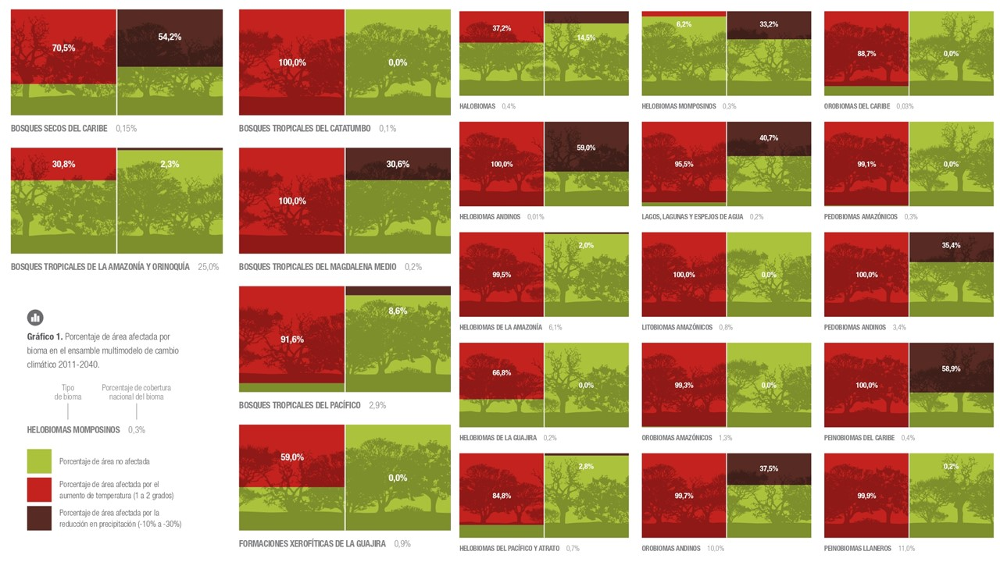

```{r setup, include=FALSE}
knitr::opts_knit$set(root.dir = "C:/humboldt/biomodelos-sdm/modelling")
```
[ENGLISH](https://biomodelos.github.io/tallerNatGeo/working-example-4.html) []( https://biomodelos.github.io/tallerNatGeo/working-example-4.html) |  [SPANISH]( https://biomodelos-github-io.translate.goog/tallerNatGeo/working-example-4.html?_x_tr_sl=en&_x_tr_tl=es&_x_tr_hl=en-US&_x_tr_pto=wapp  )  []( https://biomodelos-github-io.translate.goog/tallerNatGeo/working-example-4.html?_x_tr_sl=en&_x_tr_tl=es&_x_tr_hl=en-US&_x_tr_pto=wapp  )


# Working Example 4: projecting to different temporal period

Climate change has significantly altered precipitation and temperature trends over the past century, impacting ecosystem functioning, productivity, stability, and biodiversity (Araujo et al. 2006). Anthropogenic temperature increases have been linked to ecosystem alterations, such as nutrient eutrophication and increased fire frequencies, posing pressure on species (Hauntier et al. 2015). Furthermore, changes in rainfall patterns, extreme weather events, and ocean acidification may contribute to a potential mass extinction of biodiversity (Barnosky et al. 2011).

One of the major impacts of climate change on species is habitat alteration, leading to shifts in distribution patterns and a reorganization of biodiversity (Brambilla et al. 2022). Species distributions may remain constant in certain areas known as climate refuges or contract and expand depending on adaptation abilities and climate stability (Brambilla et al. 2022). These changes can also disrupt vital ecological interactions. In Colombia, climate change is expected to significantly affect diversity, causing shifts (Velásquez-Tibatá, Salaman and Graham, 2013), physiological adaptations, local extinctions of populations, and modifications of ecosystems and ecosystem services (Anderson et al. 2010; Gutierrez and Echeverri, 2021).


<div style="text-align: center;">
  
</div>


Niche models have become essential tools to study the impacts of climate change on species distributions, allowing for improved forecasting of future distributional areas compared to earlier methods. These models have been used to evaluate single species' distribution shifts, identify populations at risk, and explore composite future projections for entire faunas and floras (Peterson et al. 2002; Midgley et al. 2003; Thomas et al. 2004). They have also been applied in spatial conservation planning to consider current and future suitable distributional areas for European plant species (Araújo et al. 2004). Niche models help in identifying critical conservation areas and biodiversity corridors (Williams et al. 2005; Phillips et al. 2008). Despite uncertainties and debates, niche models provide valuable insights into the potential impacts of climate change on species distributions and inform conservation efforts.

## Environmental Data and Ocurrences

If you skip the last section, extract the files inside of the ".zip" folder *example* to the main root folder. It will write a folder called *example* having three other folders: *Bias_file*, *Data*, and *Occurrences*.

 - *Data* folder, where you will find 
    - *env_vars* environmental variables  representing climatic and other factors of current and future scenarios. The resolution of this layers are 10 km.
      - *other* folder to store environmental variables no related to climatic factors like topographic or remote sensing data. 
      - *worldclim* folder to store climatic variables, in this case the data come from the [worldclim](https://www.worldclim.org/) database 
    - *biogeographic_shp* useful biogeographic shapes in order to be used as template for training models or select areas of interest.

 - *Occurrences* folder, you will find three spreadsheets in ".csv" format. Each ".csv" stores occurrence data using three columns called "species", "lon" and "lat". Go to last section for more information. 

In this example, we are going to work with occurrences of the Velvet-fronted or **[Euphonia concinna](https://ebird.org/species/vefeup1?siteLanguage=en)**. 

First, we are going to call some libraries

```{r, message=F, warning=F}
library(maps)
library(dplyr)
library(ggplot2)
library(sf)
library(terra)
```

As usual, lets to explore de data

```{r}
dataSp <- read.csv("example/Occurrences/single_species_4.csv")
```

Explore the dataSp object. *Notice the change in column names*.

```{r}
names(dataSp)
nrow(dataSp)
ncol(dataSp)
```

Plot the occurrences

```{r}
col <- read_sf("example/Data/biogeographic_shp/nacional_wgs84.shp")
dataSp.points <- dataSp |>
  st_as_sf(coords = c("longitude", "latitude"), crs = sf::st_crs("EPSG:4326"))
ggplot() + 
    geom_sf(data = col, fill = "transparent", color = "black") +
    geom_sf(data = dataSp.points, color = "blue")
```


In this example, we will delve deeper into our understanding of the structure of the future folder and its associated files. The future variables are sourced from the WorldClim database. The available data represents the 2021 IPCC sixth assessment report derived from the Coupled Model Intercomparison Projects 6 (CMIP6) downscaled future climate projections. These projections are organized according to different global climate models (GCMs) and Shared Socioeconomic Pathways (SSPs), which explore potential changes in global society, demographics, and economics over the course of the next century. Collectively, these pathways are referred to as the "Shared Socioeconomic Pathways" (SSPs). For further information, you can review sources [here](https://www.carbonbrief.org/explainer-how-shared-socioeconomic-pathways-explore-future-climate-change/) and [here](https://www.carbonbrief.org/cmip6-the-next-generation-of-climate-models-explained/).

<div style="text-align: center;">
  
</div>


There are six levels of organization from the root folder (1) to the last file (6). It is important to note that levels 3 to 6 are specific to climate change scenarios. Level 3 are global climate models (GCMs), Level 4 represents different periods of time, while level 5 corresponds to development pathways or other categories that can vary according to plausible socio-economic, carbon emission, and technological futures. Level 6 stores the raster files containing the climate data for each specific combination of time and development pathway.

Additionally, it is worth mentioning that the raster files **must have** the same names as the current or present climatic data, facilitating the organization and traceability of the data. The biomodelos-sdm tool will organize the resulting files by "pasting" the folder and file names together to clearly associate the data used in each resulted distribution surface. This naming convention ensures that users can easily identify the input data used in the modeling process and interpret the outcomes accurately.

### Running

Call the biomodelos-sdm setup and load packages 

```{r, message=FALSE, warning=F}
source("setup.R")
do.load(vector.packages)
```

Load the core function fit_biomodelos

```{r}
source("R/fit_biomodelos.R")
```

The chunk code for this example is 

```{r, eval=FALSE}
fit_biomodelos(
  occ = dataSp, col_sp = "scientificName", col_lat = "latitude",
  col_lon = "longitude", clim_vars = "worldclim", dir_clim = "example/Data/env_vars/",
  dir_other = "example/Data/env_vars/other/", method_M = "polygon_MCP",
  proj_models = "M-M", remove_distance = 10, remove_method = "sqkm", extrapo = "no_ext", 
  do_future = T, compute_F = T, polygon_data = "example/Data/biogeographic_shp/Ecoregions2017_BM.shp"
)
closeAllConnections()
```

Here is a brief explanation of new the arguments. *In order to save space, those revised or equal to the working example 1 will be override.

 - do_future: logical value indicating whether to process data for future scenarios. It would be "TRUE" or "FALSE". 
 - compute_F: value indicating whether to compute environmental data for the F projection area. It can be useful if the user have pre-processed F environmental variables which are stored in a folder.
 - polygon_data:  file path to shapefile in order to extract areas of interest. Default: NULL. For example you can use ecoregions.

Where is projected the model? 

This is controlled by the area_F and method_F arguments. By default the area for time projection is the same as M or training/calibration area. Let's explore the area of interest:

```{r}
aoi <- read_sf("Euphonia.concinna/interest_areas/shape_M.shp")

ggplot() + 
    geom_sf(data = col, fill = "transparent", color = "black") +
    geom_sf(data = aoi, color = "gray") 
```

And now the area of future projection:

```{r}
aof <- read_sf("Euphonia.concinna/interest_areas/shape_F.shp")

ggplot() + 
    geom_sf(data = col, fill = "transparent", color = "black") +
    geom_sf(data = aoi, color = "gray") +
    geom_sf(data = aof, fill = "transparent", color = "red") 
```

#### Output: Folders and files

Let's explore the folders, files and results of the future projections: 

```{r}
folders <- list.dirs("Euphonia.concinna/ensembles/future", recursive = F)
folders
```
A new folder is created, it is called *future* and inside it another called MAXENT. The number of folders depends on the algorithms used.

```
files <- list.files("Euphonia.concinna/ensembles/future", recursive = T, full.names = F)
files
```

These files encompass a variety of information, including projected continuous surfaces (representing the median of good models, with the median of these models captured in file names ending with "sspXXX_MAXENT.tif"), projected binary distribution surfaces using thresholds consistent with current models (threshold values of 0, 10, 20, and 30 of the median), and the variability of models projected under new conditions (CV: Coefficient of variation, devstd: standard deviation and sum: sum of continuous models following Araujo and New, 2007).

<div style="text-align: center;">
  
</div>


The file names in the provided list follow a structured format that conveys specific information about the contents of each file. The structure is designed to help users quickly identify key details related to the projected species distribution models and associated variables. Let's break down the components of the different types of file names:

1. **Projected Continuous Surfaces:**

 - The filenames start with the species name, in this case, "Euphonia_concinna".
 - This is followed by the acronym of the climate model used, such as "EC-Earth3-Veg".
 - The time period of projection is indicated next, in the format "start year-end year" (e.g., "2021-2040").
 - The socioeconomic pathway associated with the projection comes after that, represented by "ssp245" or "ssp585".
 - The type of projection (continuous) and the modeling algorithm used ("MAXENT") are included.

2. **Projected Binary Distribution Surfaces:**

 - The structure begins with the species name, climate model acronym, time period, and socioeconomic pathway, similar to the continuous surfaces.
 - Following that, the specific threshold level used in the binary projection is mentioned (e.g., "0," "10," "20," or "30").
 - The algorithm type ("MAXENT") is also indicated in the filename.
 
3. **Variability of Models Projected to New Conditions:**

 - Similar to the previous structures, the filename starts with the species name, climate model acronym, time period, and socioeconomic pathway.
 - The type of variability measure used is denoted next, such as "CV" for Coefficient of Variation, "devstd" for standard deviation, or "sum" for sum of continuous models.
 - The algorithm type ("MAXENT") is included as well.

Overall, the structured naming conventions allow users to easily discern important information about the specific nature and parameters of each projection, facilitating efficient interpretation and utilization of the raster files for studying the impacts of climate change on species distributions.

#### Output: visualizing results

Now,we are going to visualize the dynamics of projected species distributions across different time periods and socioeconomic pathways (ssp),lets see:

 - current or present distribution (10 threshold)

```{r}
# Read raster files
rasters <- rast("Euphonia.concinna/ensembles/current/MAXENT/Euphonia_concinna_10_MAXENT.tif")|>
  crop(aoi)
plot(rasters)
```

 - future distribution (10 threshold)

```{r}
# Read raster files
rasters <- rast(list.files("Euphonia.concinna/ensembles/future", recursive = T, full.names = T)) |>
  mask(aoi)

# Set up the layout for the figure
layout(matrix(1:4, ncol = 2))

# Loop through different threshold levels
index <- grep(paste0("_", 10, "_"), names(rasters))
threshold_rasters <- rasters[[index]]

# Plot the rasters
plot(threshold_rasters, 
     main = gsub(pattern = "Euphonia_concinna_EC-Earth3-Veg_|_10_MAXENT", replacement = "", x = names(threshold_rasters)), 
     nc= 2, nr = 4)
```


## References

Anderson, E. P., Marengo, J., Villalba, R., Halloy, S., Young, B., Cordero, D.,...Ruiz, D. (2010). Consequences of climate change for ecosystems and ecosystems

services in the tropical Andes. En S. K. Herzog, R Martínez, P. Jorgensen, y H. Tiessen (eds.), Climate Change and Biodiversity in the Tropical Andes. Stanford, CA, USA: MacArthur Foundation, Inter American Institute for Global Change Research y Scientific Comittee on problems of the Environment (SCOPE). 348 p

Araújo, M. B., M. Cabeza, W. Thuiller, L. Hannah, and P. H. Williams. 2004. Would climate change drive species out of reserves? An assessment of existing reserve selection methods. Global Change Biology 10:1618–1626

Araujo, M. B., & Rahbek, C. (2006). How Does Climate Change Affect Biodiversity? Science, 313(5792), 1396–1397. doi:10.1126/science.1131758

Barnosky, A. D., Matzke, N., Tomiya, S., Wogan, G. O. U., Swartz, B., Quental, T. B., … Ferrer, E. A. (2011). Has the Earth’s sixth mass extinction already arrived? Nature, 471(7336), 51–57. doi:10.1038/nature09678

Brambilla, M., Rubolini, D., Appukuttan, O., Calvi, G., Karger, D. N., Kmecl, P., Mihelič, T., Sattler, T., Seaman, B., Teufelbauer, N., Wahl, J., & Celada, C. (2022). Identifying climate refugia for high-elevation Alpine birds under current climate warming predictions. Global Change Biology, 28, 4276– 4291. https://doi.org/10.1111/gcb.16187

Gutiérrez, J. y Echeverry, M. (2014). Cambio climático y biomas colombianos. En: Bello et al. (ed). Biodiversidad 2014. Estado y tendencias de la biodiversidad continental en Colombia. Instituto Alexander von Humboldt. Bogotá D.C., Colombia.

Hautier, Y., Tilman, D., Isbell, F., Seabloom, E. W., Borer, E. T., & Reich, P. B. (2015). Anthropogenic environmental changes affect ecosystem stability via biodiversity. Science, 348(6232), 336–340. doi:10.1126/science.aaa1788

Midgley, G. F., L. Hannah, D. Millar, W. Thuiller, and A. Booth. (2003). Developing re gional and species-level assessments of climate change impacts on biodiversity in the Cape Floristic Region. Biological Conservation 112:87–97.

Peterson, A. T., M. A. Ortega-Huerta, J. Bartley, V. Sánchez-Cordero, J. Soberón, R. H. Buddemeier, and D.R.B. Stockwell. (2002). Future projections for Mexican fau nas under global climate change scenarios. Nature 416:626–629.

Phillips, S. J., and M. Dudík. (2008). Modeling of species distributions with Maxent: New extensions and a comprehensive evaluation. Ecography 31:161–175

Thomas, C. D., A. Cameron, R. E. Green, M. Bakkenes, L. J. Beaumont, Y. C. Colling ham, B. F. N. Erasmus, M. F. de Siqueira, A. Grainger, L. Hannah, L. Hughes, B. Huntley, A. S. van Jaarsveld, G. F. Midgley, L. Miles, M. A. Ortega-Huerta, A. T. Peterson, O. L. Phillips, and S. E. Williams. (2004). Extinction risk from climate change. Nature 427:145–148.

Williams, P. H., L. Hannah, S. Andelman, G. Midgley, M. B. Araújo, G. Hughes, L. Manne, E. Martínez-Meyer, and R. G.
Pearson. (2005). Planning for climate change: Identifying minimum-dispersal corridors for the Cape Proteaceae. Conservation Biology 19:1063–1074.
